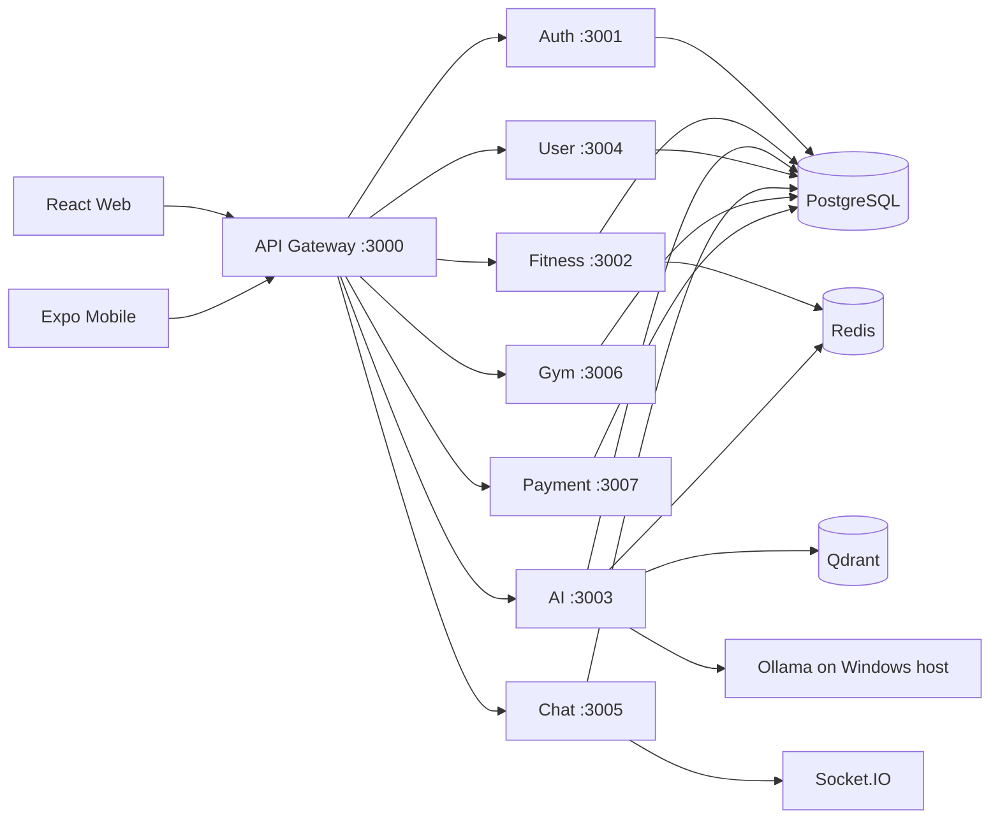

# Fitness Assistant

> An AI-powered fitness platform that connects personalized coaching, workout
> tracking, body-composition insights, personal trainers, gyms, and payments in
> one microservices workspace.

[](https://www.typescriptlang.org/)
[](https://react.dev/)
[](https://nodejs.org/)
[](https://www.postgresql.org/)
[](https://docs.docker.com/compose/)
[](https://ollama.com/)

Fitness Assistant is a full-stack portfolio project built around real product
workflows rather than a collection of disconnected demos. Customers can track
training and InBody measurements, generate evidence-aware plans, work with a
PT, purchase gym services, and chat in real time. PTs, gym owners, and admins
have dedicated role-based workspaces.

## Product Highlights

| Area | What is implemented |
| --- | --- |
| AI coach | Streaming chat, intent routing, user context, safety fallbacks, citations, conversation memory |
| Planning | Asynchronous workout and nutrition generation, plan validation, PT review, save-to-calendar flow |
| Training | Exercise catalog, workout schedules, per-set logging, progressive overload, adaptive training cycles |
| Body composition | Manual and OCR-assisted InBody records, trends, deterministic metrics, AI-supported interpretation |
| Coaching | PT applications, contracts, client management, schedules, plan review, realtime chat |
| Gym platform | Gym discovery and management, membership plans, trainer listings, owner workspace |
| Commerce | Wallet, top-up and withdrawal flows, service payments, marketplace packages, provider adapters |
| Operations | Health checks, seed data, admin monitoring, n8n automation, Prometheus/Grafana profiles, Docker test stack |
| Mobile | Expo application sharing the same backend contracts, with offline-oriented workout logging foundations |

## Architecture



The services own separate PostgreSQL databases while sharing one development
PostgreSQL container. The gateway is the browser-facing API boundary. Qdrant
stores retrieval collections; Ollama provides chat completion and embeddings.

## AI Design

The running application combines deterministic fitness logic with RAG. It does
not rely on the LLM as the sole decision maker.

- Chat model: `fitness-coach-qwen2.5-1.5b:q4_K_M` by default
- Embedding model: `nomic-embed-text` with 768 dimensions
- Vector store: Qdrant collections for exercises, fitness knowledge, FAQs, and evidence
- Context: profile, InBody, workout schedule, nutrition history, and conversation memory
- Guardrails: schema validation, safety rules, deterministic fallback, and evidence metadata
- Optional research: a separate QLoRA pipeline under `training/`; it is not required to run the product

See [AI architecture](docs/ai-rag-architecture.md) and
[AI operations](docs/ai-service-operations.md).

## Tech Stack

| Layer | Technologies |
| --- | --- |
| Web | React, Vite, TypeScript, Tailwind CSS, TanStack Query, Zustand |
| Mobile | Expo, React Native, Expo Router |
| Backend | Node.js, Express, TypeScript, Prisma, Zod, BullMQ, Socket.IO |
| Data | PostgreSQL, Redis, Qdrant |
| AI | Ollama, custom Qwen model, `nomic-embed-text`, retrieval-augmented generation |
| Platform | Docker Compose, n8n, Prometheus, Grafana |
| Quality | Unit/integration tests, isolated Docker tests, external Playwright E2E harness |

## Quick Start

### Prerequisites

- Node.js 20+
- pnpm 8+
- Docker Desktop
- Ollama for the AI features

### 1. Configure the workspace

```powershell
Copy-Item .env.example .env
pnpm install
```

Review `.env` before starting. Development defaults are intentionally local,
but secrets and production credentials must be replaced.

### 2. Start Ollama on Windows

The default Compose configuration reaches Ollama through
`host.docker.internal:11434`. Ollama must listen beyond loopback so Docker
Desktop can connect.

```powershell
$env:OLLAMA_HOST = "0.0.0.0:11434"
ollama serve
```

In another PowerShell terminal:

```powershell
ollama list
Invoke-RestMethod http://127.0.0.1:11434/api/tags
```

The configured chat model and `nomic-embed-text` must appear in the model list.
Use `LLM_MODEL` in `.env` to select another installed chat model.

### 3. Start the platform

```powershell
docker compose -f infra/compose/docker-compose.dev.yml up -d --build
docker compose -f infra/compose/docker-compose.dev.yml ps
```

Open `http://localhost:5173`. The API health endpoint is available at
`http://localhost:3000/health`.

The development seeder creates disposable accounts such as
`testuser001@example.com` and `testpt001@example.com`; their password is
`Test@123456`.

Full setup, model switching, profiles, and troubleshooting are documented in
[Development setup](docs/setup/README.md).

## Service Map

| Component | Port | Responsibility |
| --- | ---: | --- |
| Web | 5173 | React client and Vite proxy |
| API Gateway | 3000 | Authentication boundary, routing, rate limits |
| Auth Service | 3001 | Accounts, JWT, roles, audit events |
| Fitness Service | 3002 | Exercises, workouts, schedules, training cycles |
| AI Service | 3003 | Chat, RAG, plans, AI observability |
| User Service | 3004 | Profiles, InBody, PT contracts and applications |
| Chat Service | 3005 | Conversations and realtime messaging |
| Gym Service | 3006 | Gyms, memberships, trainers, owner operations |
| Payment Service | 3007 | Wallet and payment-provider flows |
| PostgreSQL | 5433 | Development databases |
| Redis | 6379 | Cache and job queues |
| Qdrant | 6333 | Vector search |

Optional Compose profiles: `local-ollama`, `knowledge`, `automation`, and
`observability`.

## Verification

```powershell
pnpm run lint
pnpm run build
pnpm test
pnpm docker:test:fast
```

For an isolated infrastructure-backed test run:

```powershell
pnpm docker:test:full
```

The external browser harness is documented in
[`fitnessassistant-playwright-e2e/AGENT_HANDOFF.md`](fitnessassistant-playwright-e2e/AGENT_HANDOFF.md).

## Repository Guide

```text
apps/mobile/                       Expo mobile client
backend/gateway/                   Public API gateway
backend/services/                  Domain microservices
backend/shared/                    Shared TypeScript utilities
data/                              Catalog, RAG, research, and evaluation data
docs/                              Architecture, operations, QA, and decision records
fitnessassistant-playwright-e2e/   External Playwright E2E harness
frontend/web/                      React web application
infra/                             Compose, monitoring, n8n, and deployment assets
training/                          Optional model fine-tuning research pipeline
```

Start with the [documentation index](docs/README.md) instead of browsing old
reports by filename.

## Safety And Scope

Fitness Assistant provides educational fitness guidance. It is not a medical
diagnosis system. The AI layer is designed to avoid invented citations, unsafe
rapid-weight-loss advice, and recommendations to train through injury. Real
personal or medical data must never be committed to the repository or included
in model-training datasets without explicit permission and anonymization.

## Project Status

This is an actively developed portfolio project. Core web and backend flows are
implemented; mobile, production deployment hardening, provider integrations,
and advanced PT workflows remain evolving areas. Historical audits and plans
are retained as engineering records and are labeled in the documentation index.
