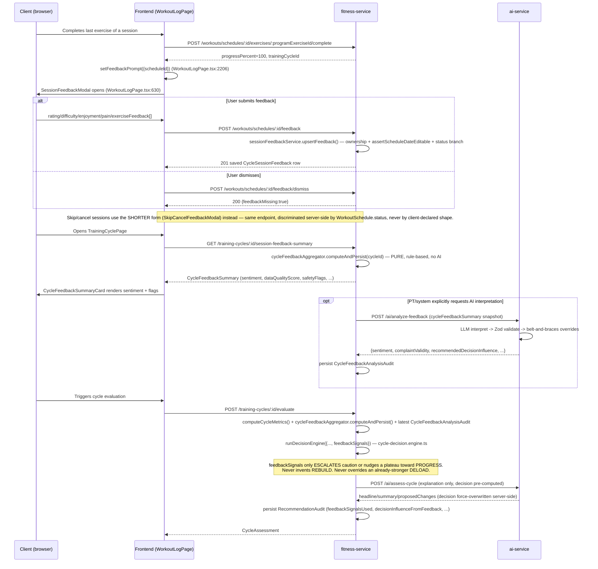

# Session Feedback, PT/Coach Mode & Plan Marketplace — Audit + Design

> Phase 1 deliverable. Every fact below is verified against the actual code on branch `feature/session-feedback-pt-mode` (based on `aws-deploy`), not assumed. Phases 2-12 (implementation) follow this document.

## 1. Current state (answers to the 12 audit questions)

**1. Workout session storage**: `WorkoutSchedule` (fitness-service, `workout_schedules` table). One row per calendar day per user (`@@unique([userId, date])`). Holds `status`, `progressPercent`, `totalExercises`/`completedExercises`, `totalSets`/`completedSets`, `durationSeconds`, `sourcePlanId`, `trainingCycleId` (nullable — a session can exist outside any cycle).

**2. Workout log statuses**: `WorkoutSchedule.status` is a plain string (app-validated, not a DB enum): `NOT_STARTED | IN_PROGRESS | PARTIALLY_COMPLETED | COMPLETED | SKIPPED | CANCELLED`. No separate `MISSED` value — "missed" is a *derived* concept computed at query time (`missedSessions = schedules.filter(s => s.status !== "COMPLETED" && s.date < now)` in `training-cycle.service.ts`), covering SKIPPED/CANCELLED/NOT_STARTED/IN_PROGRESS/PARTIALLY_COMPLETED sessions whose date has passed.

**3. Training cycle end flow**: Unified (Phase 7, earlier this session). Both `POST /training-cycles/:id/complete` (legacy) and `POST /training-cycles/:id/evaluate` (adaptive) funnel through `trainingCycleService.runVersionedAssessment()`: `computeCycleMetrics()` → `runDecisionEngine()` (6-way: KEEP/PROGRESS/ADJUST/DELOAD/REBUILD/INSUFFICIENT_DATA) → `assessCycleSafe()` (LLM explanation, never decides) → persists a versioned `CycleAssessment` + a `RecommendationAudit` row.

**4. Decision Engine input** (`DecisionEngineInput`, `cycle-decision.engine.ts`): `cycleDurationDays`, `completedSessions`, `metrics: CycleMetricsResult` (adherence, volume trend/slope, exercise progression, e1RM trend, strength/performance-consistency scores, RPE/pain/fatigue/recovery, body-composition trends, `goalProgressScore`, `dataQualityScore`, `nutritionConsistencyScore`, `missedSessionCount`), `priorCycleDecisions`, `goalOrContextChangedSincePriorCycle`, `experienceLevel`, `competesInSport`. **Already reads session-level subjective feedback** via `CycleMetricsResult.averageSessionRpe/averagePainScore/fatigueScore/recoveryScore`, sourced from `CycleSessionFeedback` rows.

**5. AI recommendation/explanation payload** (`AssessCycleRequestSchema`, ai-service): `userId`, `cycle` (goal/duration/experienceLevel/competesInSport), `dataQuality`, `computedMetrics` (full `CycleMetricsResult`, passed through), `decision` (value/confidence/actionScope — **already decided**, LLM only explains), `reasonCodes`, `safetyFlags`, `currentPlanSummary`, `allowedChanges` (constrains what the LLM may propose). Output: `AssessCycleOutputSchema` — headline/summary/positive+warning signals/proposedChanges/missingData/safetyNotice, with `decision` echoed back but **overwritten server-side** with the real engine value regardless of what the model returns.

**6-7. PT/Coach mode**: Partially exists, workout-blind. Roles (auth-service): `CUSTOMER | PT | ADMIN | GYM_OWNER | GYM_STAFF` — no separate COACH/TRAINER value, `PT` is the coach role. A full "become a PT" application→admin-approval pipeline exists (`PTApplication`, `UserProfile.isPT`). **`Contract`** (user-service, `contracts` table: `ptUserId`, `clientUserId`, `status: PENDING_REVIEW|PENDING_SIGNATURE|PENDING_PAYMENT|ACTIVE|COMPLETED|EXPIRED|CANCELLED|REJECTED`) already *is* the PT-client relationship — `contract.repository.ts` already has `findByPT(ptUserId, status?)`, trivially giving "all active clients for a PT." PT frontend pages (`PTClientList`, `PTClientDetail`, `PTDashboard`, `PTSchedulePage`, `PTContractsPage`, `PTWalletPage`, `PTProfilePage`, `PlanReviewPage`) exist but are **100% contract/scheduling/payment-focused — `PTClientDetail.tsx` never calls fitness-service**, shows zero workout/training-cycle/InBody data. Fitness-service has **zero PT-awareness**: every `training-cycle.routes.ts` endpoint acts only on `req.user!.id`; no endpoint anywhere lets one user create/view/assign a plan or cycle for a different `userId`. The closest existing cross-user mechanic is ai-service's `WorkoutPlan.ptReviewStatus` (client generates their own plan citing an active contract, PT can only approve/reject via `PlanReviewPage.tsx` — never authors or assigns).

**8-9. Plan marketplace**: Exists, mid-featured. `WorkoutPlan` (ai-service, own `version` field for a client's own "regenerate adjusted plan" flow, unrelated to marketplace) → `PublishedPlan` (title/description/goal *snapshotted* at publish time, `moderationStatus: DRAFT/SUBMITTED/APPROVED/REJECTED`, `avgRating`/`ratingCount`) → `PlanReview` (`rating 1-5` + optional `comment`, **single dimension only** — no difficulty/goal-fit/equipment-fit axes, one review per user per listing, DB-unique-enforced). Publishing: any authenticated user (no PT-only gate) can publish their own `COMPLETED` plan; needs admin moderation. Reviewing is gated server-side by `hasCompletedCycleForPlan` (calls fitness-service). **No `PublishedPlan` versioning** (no `version`/`previousVersionId`/changelog — a listing can only be withdrawn, which hard-deletes and cascades reviews/packages). **No quality-score concept beyond raw avgRating/ratingCount.** **No AI improvement-suggestion mechanism.** **No "adopt this plan" user action** in the marketplace UI at all today.

**10. RecommendationAudit**: Exists (`recommendation_audits` table) — `userId`, `cycleId`, `assessmentId`, `engineVersion`, `decision`, `reasonCodes`, `metricsSnapshot` (full replayable `CycleMetricsResult`), `aiSummary`, `presentedAt`, `userAction`. Written by `runVersionedAssessment()` on every evaluate/complete call.

**11. Qdrant/RAG evidence path**: `retriever.retrieveEvidence()` → `evidenceUsedFromDocs()` (title+source_url citation gate) — already used by `cycle-assessment.service.ts` for cycle explanations, reusable as-is for feedback-analysis explanations without any change.

**12. Relevant UI screens**: `WorkoutLogPage.tsx` (session logging), `TrainingCyclePage.tsx` (`ActiveCycleCard`, `DecisionCard`, `CycleHistoryRow`), `ProfilePage.tsx`/`OnboardingWizardPage.tsx`, `PlanMarketplacePage.tsx` (4 tabs: Browse/Mine/Buy/Sell packages), `AIPlansPage.tsx`, and the PT pages listed in §6-7 above.

## 2. Critical existing asset: `CycleSessionFeedback` already exists

This is the single most important finding for Phase 2. `CycleSessionFeedback` (fitness-service, `cycle_session_feedback` table) **already implements a slice of what's being requested**:

```
readinessScore Int?    // 1-10, pre-session
sessionRpe     Float?  // 1-10, post-session overall RPE
painScore      Int?    // 0-10
notes          String?
```

1:1 with `WorkoutSchedule` (`@unique workoutScheduleId`), tied to `cycleId` (currently **required, not nullable** — a real gap vs. "feedback for any session, cycle or not"). Written via `POST /training-cycles/:id/sessions/:scheduleId/feedback`, gated by `assertScheduleDateEditable` (same-calendar-day-only edits — a real, already-documented UX constraint: fatigue/pain data is only capturable in a narrow same-day window, nothing this project can silently change without revisiting that gate). **Already consumed** by `computeFatigueRecoveryMetrics()` in `cycle-metrics.engine.ts`, feeding `averageSessionRpe`/`averagePainScore`/`fatigueScore`/`recoveryScore` into `CycleMetricsResult`, which the Decision Engine already reads.

**Design decision**: Phase 2 extends this table additively rather than building a parallel `SessionFeedback` system. This directly satisfies "không phá training-cycle flow hiện có / backward compatible" and means Phase 5's Decision Engine integration is "add more signals to an aggregation pipeline that already exists" rather than a new data path end to end.

## 3. Proposed architecture

### 3.1 Schema changes (fitness-service, additive only)

**`CycleSessionFeedback`** (Prisma model renamed to `SessionFeedback` for clarity going forward — `@@map("cycle_session_feedback")` keeps the same physical table, zero migration needed for the rename itself):
- `cycleId` becomes **nullable** (a session outside any cycle can still get feedback).
- New nullable columns: `sessionRating Int?` (1-5, distinct from the existing 1-10 `sessionRpe` which is an RPE scale, not a satisfaction scale), `difficulty String?` (`too_easy|just_right|too_hard`), `enjoyment String?` (`low|medium|high`), `fatigueAfterSession Int?` (1-10, distinct from `readinessScore` which is *pre*-session), `painLocation String?`, `wouldRepeatSession String?` (`yes|no|unsure`), `perceivedProgress String?` (`better_than_last_time|same|worse|unsure`), `feedbackMissing Boolean @default(false)` (explicit "user was prompted and dismissed" sentinel, distinct from "row doesn't exist yet" = never prompted). Reuse existing `notes` for `sessionComment` — no duplicate free-text column.
- New skip/cancel-specific nullable columns (only populated when the linked `WorkoutSchedule.status` is `SKIPPED`/`CANCELLED`): `skipReason String?` (`fatigue|pain|schedule_conflict|motivation|illness|equipment_unavailable|too_hard_previous_session|other`), `shouldAdjustPlan Boolean?`, `userAvailableMakeupDay DateTime?`.

**New `ExerciseSessionFeedback`** (one-to-many from `SessionFeedback`, since a session has multiple exercises): `id`, `sessionFeedbackId`, `exerciseId`, `rating Int?`, `issueType String?` (`too_heavy|too_light|too_many_sets|too_few_sets|uncomfortable|pain|boring|liked|confusing|equipment_unavailable`), `note String?`.

**No changes to `WorkoutSchedule`, `TrainingCycle`, `CycleAssessment`, `CycleMetricsEngine`'s existing return shape** (new fields are additive to `CycleMetricsResult`, not replacements).

### 3.2 Cycle feedback summary (Phase 3) — deterministic, code-only

New `cycle-feedback-aggregator.ts` in fitness-service, same layer as `cycle-metrics.engine.ts` (not ai-service — matches "code tính, AI chỉ diễn giải"). Pure function over `SessionFeedback[]` + `WorkoutSchedule[]` for a cycle. Rule-based sentiment classification exactly as specified by the user (rating≤2 or pain≥7 or wouldRepeat=no → negative; rating≥4 and difficulty=just_right and pain≤3 → positive; etc.), `dataQualityScore` from `feedbackCompletionRate`, safety/equipment/adherence/motivation flag arrays. Output persisted as a new `CycleFeedbackSummary` row (one per cycle, like `CycleAssessment`) so it's queryable/auditable, not just computed on the fly.

### 3.3 AI feedback analysis (Phase 4) — new ai-service endpoint, same pattern as `/ai/assess-cycle`

New `POST /ai/assess-feedback`, `assessFeedbackSafe()` client wrapper (mirrors `assessCycleSafe` in `ai.client.ts`), `FeedbackAnalysisRequestSchema`/`FeedbackAnalysisOutputSchema` (mirrors `AssessCycleRequestSchema`/`AssessCycleOutputSchema`). Input: `cycleFeedbackSummary` + the *same* `computedMetrics`/`decision`/`experienceLevel`/`competesInSport` already sent to `/ai/assess-cycle` (feedback validity can only be judged against objective data). Output structured exactly per the user's spec (`sentiment`, `complaintValidity`, `complaintCategories`, `recommendedDecisionInfluence`, etc.) — Zod-validated, deterministic-template fallback on failure (existing pattern). Persisted to new `CycleFeedbackAnalysisAudit` table. **Never sets `decision` — only ever an influence hint the engine may or may not act on**, same guardrail already enforced for `AssessCycleOutput.decision` being overwritten server-side.

### 3.4 Decision Engine integration (Phase 5) — additive input, no override of safety

`DecisionEngineInput` gains optional `feedbackSignal?: { sentiment, complaintValidity, recommendedInfluence, dataQuality }`. New branch logic sits *alongside* existing metric-based rules, never replacing the safety-flag/data-quality gates that already exist — feedback can nudge ADJUST/DELOAD when it's *corroborated* by real RPE/pain/adherence data (already-computed metrics), and is explicitly ignored (or only mentioned, never acted on) when `complaintValidity` is `not_supported`/`insufficient_data`. `RecommendationAudit` gains `feedbackSignalsUsed`/`feedbackSummarySnapshot`/`aiFeedbackAnalysisId`/`complaintValidity` fields (additive JSON columns).

### 3.5 PT/Coach mode (Phase 6-7)

Reuse `Contract` (not a new `TrainerClient` table) as the PT-client relationship source of truth — `status: ACTIVE` = an authorized relationship. New fitness-service internal endpoint (matches the existing `internal.routes.ts` cross-service pattern already used for `/internal/exercises/for-ai-plans` etc.) for user-service/gateway to fetch a client's workout/cycle summary, gated by an internal-secret header plus a **fresh** contract-ACTIVE check server-side (never trust a client-supplied "I'm authorized" claim). New fitness-service endpoints: `POST /training-cycles/coach-assign` style, taking an explicit `clientUserId` distinct from `req.user!.id`, re-validating the ACTIVE contract on every call (not just at UI-select time). AI-assisted draft generation (Phase 7) reuses the existing plan-generation LLM pipeline with a `PENDING_PT_REVIEW`-style gate before any assignment — PT must explicitly confirm before a plan touches the client's calendar, matching the existing `ptReviewStatus` precedent already in the codebase.

### 3.6 Plan marketplace review flow (Phase 8)

Add `PublishedPlan.version Int @default(1)` + `previousVersionId String?` (self-relation) — publishing a "new version" creates a new `PublishedPlan` row linked via `previousVersionId` rather than mutating the existing one, so existing `PlanReview`/`TrainingPackage`/adopted-plan references to the old version are untouched (addresses the audited gap: withdraw is currently destructive). New `PlanImprovementSuggestion` table (AI-generated, `status: PENDING|ACKNOWLEDGED|APPLIED|DISMISSED`, never auto-applied — owner must explicitly act, matching "AI không được tự sửa/publish plan public ngay"). `PlanQualityScore` computed deterministically (not by AI) from `avgRating` + completion-rate-of-adopters (requires closing the audited "no adopt action" gap minimally — see risks below) + safety-flag frequency from linked cycles' `CycleFeedbackSummary` rows where `sourcePlanId` matches.

## 4. Risks / open items flagged honestly

- **The marketplace has no "adopt plan" action today at all.** `hasCompletedCycleForPlan` gating implies *some* path from "published plan" to "a training cycle running that plan," but the audit found no adopt/clone UI action. Phase 8's `PlanPerformanceStats`/quality score is only as good as this gap being closed — will implement a minimal adopt endpoint (copy `sourcePlan.plan` JSON into a new `WorkoutPlan` for the adopting user) as part of Phase 8, flagged as new scope beyond pure "review" but required for the review flow to be meaningful.
- **`assertScheduleDateEditable`'s same-day-only gate is not being loosened.** Skipped/cancelled feedback for a session logged same-day still works; retroactive feedback on older sessions will surface `feedbackMissing=true` permanently, by design — already-documented, accepted constraint from Phase 13 QA.
- **PT client-data access is new cross-service surface area** — every new endpoint re-validates the `Contract.status === ACTIVE` server-side per-request, not cached/trusted from a prior check, to avoid a stale-authorization bug class.
- **No mobile app changes** — `apps/mobile` is out of scope unless explicitly requested; this plan targets `frontend/web` only, matching how prior phases in this session scoped work.

## 5. Test plan

See Phase 11 in the implementation phases. Every phase below ships its own tests before being marked complete; Phase 11 is the final consolidation/gap-fill pass, not the first time tests are written.

## 6. Implementation roadmap

Phases 2-12 as specified in the original request, executed in order, each with its own commit-worthy unit of work: session feedback schema+API+UI → cycle feedback aggregator → AI feedback analysis → Decision Engine integration → PT client data access → AI-assisted PT plan drafting → marketplace versioning/quality/improvement → event-flow docs → UI polish → test matrix → final verification report.

---

<a id="merged-session-feedback-event-flow"></a>

## Consolidated reference: SESSION_FEEDBACK_EVENT_FLOW.md

> Consolidated 2026-09-07. Original dates, verification results and deployment
> snapshots below are historical; confirm them against current code/environment.

## Flow A — Session Feedback (normal user)

> Verified against the actual implementation on branch `feature/session-feedback-pt-mode` (Phases 2–5 of `docs/SESSION_FEEDBACK_AND_PT_PLAN_AUDIT.md`), not just described from the spec. File/line references point at the real code.

### Actors
- **Client** (any authenticated user with a workout schedule).
- **fitness-service** — owns `WorkoutSchedule`, `CycleSessionFeedback`, `ExerciseSessionFeedback`, `CycleFeedbackSummary`, `CycleFeedbackAnalysisAudit`, `RecommendationAudit`.
- **ai-service** — owns the feedback-interpretation LLM call (advisory only).

### End-to-end sequence



### States a session's feedback can be in

| State | Meaning | Set by |
|---|---|---|
| No row exists | Never prompted | Default |
| Row exists, `feedbackMissing=false` | User submitted real feedback | `POST .../feedback` |
| Row exists, `feedbackMissing=true` | User was prompted and explicitly dismissed | `POST .../feedback/dismiss` |
| Row has `skipReason` set | Session was SKIPPED/CANCELLED and user gave a reason | `POST .../feedback` while `WorkoutSchedule.status` is SKIPPED/CANCELLED |

`feedbackMissing` and "no row" are deliberately distinct (`session-feedback.service.ts`) — the aggregator (`cycle-feedback-aggregator.ts`) and the UI badge (`SessionFeedbackStatusRow`, `WorkoutLogPage.tsx`) both treat them the same way for display ("chưa ghi cảm nhận") but the underlying data lets a future analysis distinguish "never asked" from "asked and declined."

### Which form is used, and why

The **completion form** (`completionFeedbackSchema`) and the **skip/cancel form** (`skipCancelFeedbackSchema`) share one endpoint (`POST/PATCH /workouts/schedules/:id/feedback`) but the service picks which one applies by reading the **real** `WorkoutSchedule.status` server-side (`session-feedback.service.ts:upsertFeedback`) — never by trusting which shape the client posted. A client cannot submit a skip-form payload against a COMPLETED session or vice versa; the service throws 400 (missing required field for the actual state) or 409 (status doesn't accept feedback at all, e.g. `NOT_STARTED`).

### Data quality → decision influence, concretely

`cycle-feedback-aggregator.ts`'s `dataQualityScore = feedbackCompletionRate × min(1, feedbackSubmittedCount/3)`. Below `cycleThresholds.feedback.minimumDataQualityScore` (default 0.34, stricter 0.6 for professional/competing athletes), `cycle-decision.engine.ts`'s `applyFeedbackInfluence` refuses to let feedback move the decision at all — this is the concrete mechanism behind "missing feedback => no strong change."

### Safety invariants verified by test (not just asserted in prose)

- `cycle-feedback-aggregator.test.ts` (14 tests) — sentiment classification, safety-flag triggers, dismissed-feedback exclusion.
- `session-feedback.integration.test.ts` (10 tests) — ownership, status-gating, upsert-not-append for exercise feedback.
- `cycle-decision-feedback.engine.test.ts` (16 tests) — every rule in the table below, plus "feedback never escalates to REBUILD," "feedback never downgrades an already-stronger DELOAD."
- `feedback-analysis.test.ts` (ai-service, 12 tests) — every belt-and-braces override (low-data-quality forces `insufficient_data`/`none`; unsupported complaint forces `none`; positive-sentiment-but-high-pain forces a risk flag even if the model omitted it).

| Feedback pattern | Decision Engine effect | Test |
|---|---|---|
| "chê nặng" + rising pain + rising RPE | Escalate to DELOAD | `too_hard complaint + rising pain + increasing RPE -> escalates KEEP to DELOAD` |
| "chê dễ" + high adherence + stable RPE/volume | Upgrade to PROGRESS (never downgrades a stronger decision) | `too_easy complaint + high adherence + stable RPE/volume -> upgrades KEEP to PROGRESS` |
| Equipment complaint | Nudge to ADJUST (exercise substitution) | `equipment mismatch complaint escalates KEEP to ADJUST` |
| Boredom + good progress | Decision unchanged, scope nudged to minor_adjustment | `boredom complaint ... keeps PROGRESS decision but bumps action scope` |
| Positive sentiment + high pain | Force ADJUST/DELOAD regardless of good rating | `positive overall sentiment but high average pain forces ADJUST` |


---

<a id="merged-pt-client-plan-assignment-flow"></a>

## Consolidated reference: PT_CLIENT_PLAN_ASSIGNMENT_FLOW.md

> Consolidated 2026-09-07. Original dates, verification results and deployment
> snapshots below are historical; confirm them against current code/environment.

## Flow B — PT/Coach Client Plan Assignment

> Verified against the actual implementation on branch `feature/session-feedback-pt-mode` (Phases 6–7 of `docs/SESSION_FEEDBACK_AND_PT_PLAN_AUDIT.md`). This flow deliberately REUSES the existing `Contract` model (user-service) as the PT-client authorization source of truth — see the audit doc's "Existing PT infrastructure to REUSE" finding — rather than introducing a new relation table.

### Actors
- **PT** — a user with an ACTIVE `Contract` to a client (`Contract.ptUserId`/`Contract.clientUserId`/`Contract.status`, user-service).
- **Client** — the contract's `clientUserId`.
- **user-service** — owns `Contract`, exposes the internal authorization check.
- **fitness-service** — owns `CoachClientActionAudit`, `PlanGenerationAudit`, and reuses `workoutService.createManualProgram` unchanged.
- **ai-service** — owns the draft-generation LLM call (advisory only).

### Authorization — the one rule everything else depends on

Every `/coach/*` request in fitness-service is gated by a **fresh, per-request** cross-service call, never cached:

```
fitness-service (coach.service.ts: assertActivePtClientRelationship)
  --GET /internal/contracts/active-relationship?ptUserId=&clientUserId=-->
  user-service (contract.controller.ts: checkActivePtClientRelationship)
  --{active: boolean}-->
```

`contractRepository.findActivePtClientPair` (user-service) checks `ptUserId + clientUserId + status === ACTIVE` — strictly, direction-specific, unlike the pre-existing `findActiveByPair`/`findRelationshipByPair` (which also match PENDING_SIGNATURE/COMPLETED and are direction-agnostic — fine for chat eligibility, not fine for "can this PT write training data for this client"). If the relationship check fails or times out, `coach.service.ts` fails **closed** (denies), never open.

### End-to-end sequence

```mermaid
sequenceDiagram
    participant PT as PT (browser)
    participant FE as Frontend (PTClientDetail / AssignPlanModal)
    participant FS as fitness-service
    participant US as user-service
    participant AI as ai-service

    PT->>FE: Opens a client's detail page
    FE->>FS: GET /coach/clients/:clientId/summary
    FS->>US: verify ACTIVE relationship (internal, fresh)
    US-->>FS: {active:true}
    FS->>FS: trainingCycleService.getActiveCycle(clientId) + cycleFeedbackAggregator + getPriorCycleDecisions
    FS->>FS: audit VIEW_CLIENT_SUMMARY (CoachClientActionAudit)
    FS-->>FE: {activeCycle, cycleSummary, feedbackSummary, priorDecisions}
    FE->>PT: ClientFitnessSummaryCard — same inputs the Decision Engine itself uses

    PT->>FE: Clicks "Giao kế hoạch" -> AssignPlanModal
    opt PT clicks "Gợi ý bằng AI"
        FE->>FS: POST /coach/clients/:clientId/plan-draft {ptNotes, daysPerWeek, durationWeeks}
        FS->>US: verify ACTIVE relationship (fresh, again)
        FS->>FS: fetchUserProfile(clientId) — experienceLevel, injuries
        FS->>FS: prisma.exercise.findMany (shuffled catalog sample)
        FS->>AI: POST /ai/generate-client-plan-draft
        AI->>AI: filter exercises touching reported injury areas BEFORE the model sees them
        AI->>AI: LLM draft -> Zod validate -> drop any exerciseId outside the allowed catalog
        AI-->>FS: {days[], dataGaps[], warnings[], summaryForPt}
        FS->>FS: persist PlanGenerationAudit (draft only, nothing assigned yet)
        FS-->>FE: draft with resolved exercise names
        FE->>PT: Pre-fills the SAME editable day/exercise form — PT can add/remove/edit before submitting
    end

    PT->>FE: Reviews/edits, clicks "Tạo & giao kế hoạch"
    FE->>FS: POST /coach/clients/:clientId/plans (createManualProgramSchema payload)
    FS->>US: verify ACTIVE relationship (fresh, again)
    FS->>FS: workoutService.createManualProgram(clientId, input) — UNCHANGED from client self-service
    Note over FS: Same call creates the WorkoutProgram AND generates WorkoutSchedule rows —<br/>this single call already covers "assign with start date/cycle length/days/notes."
    FS->>FS: audit CREATE_AND_ASSIGN_PLAN (CoachClientActionAudit)
    FS-->>FE: {program, createdScheduleCount, ...}

    Note over FE: Client sees the assigned plan via their EXISTING GET /workouts/programs/current —<br/>no new client-facing endpoint needed; a PT-created program is indistinguishable in shape from a self-created one.
```

### Why the AI draft can never become an assignment by itself

1. `POST /coach/clients/:clientId/plan-draft` writes only to `PlanGenerationAudit` — it never touches `WorkoutProgram`/`WorkoutSchedule`.
2. The draft response feeds the **same editable form state** (`AssignPlanModal.tsx`'s `days`) the PT would fill in by hand — there is no "one-click accept" path that skips the form.
3. Assignment only happens via the separate, explicit `POST /coach/clients/:clientId/plans` call, which the PT triggers themselves after (optionally) editing.
4. Injury safety is enforced **before** the LLM ever sees the exercise catalog (`client-plan-draft.service.ts:filterExercisesForInjuries`), not just requested via prompt — verified by `client-plan-draft.test.ts`'s "excludes LOWER_BODY (and FULL_BODY) exercises when client reports a knee injury" test, which uses a mocked LLM that *tries* to propose the excluded exercise anyway and confirms it never survives.

### Audit trail

| Table | Records | Written by |
|---|---|---|
| `CoachClientActionAudit` | Every view or write a PT makes against a client (`VIEW_CLIENT_SUMMARY`, `CREATE_AND_ASSIGN_PLAN`) | `coach.service.ts` |
| `PlanGenerationAudit` | Every AI draft request, including the full request snapshot and returned draft, regardless of whether the PT used it | `coach.service.ts:generatePlanDraft` |

Neither table is ever consulted to *authorize* a request — authorization is always the live `user-service` check above; these tables are a record of what happened, not a cache of what's allowed.

### Verified by test

- `coach.service.integration.test.ts` (5 tests) — sees-own-client data, cannot-see-unrelated (403), inactive-relation-rejected (403), plan created for the CLIENT not the PT, audit row created on both view and assign.
- `coach-plan-draft.integration.test.ts` (2 tests) — 403 without an active relationship (and no audit row written), and for an authorized PT the draft is always well-shaped (LLM success or fallback) with a persisted audit row and **nothing assigned**.
- `client-plan-draft.test.ts` (ai-service, 9 tests) — injury exclusion, invented-exerciseId dropping, data-gap transparency forced even when the LLM omits it, deterministic fallback, and a structural check that the output schema has no field for naming a commercial program.


---

<a id="merged-plan-marketplace-review-flow"></a>

## Consolidated reference: PLAN_MARKETPLACE_REVIEW_FLOW.md

> Consolidated 2026-09-07. Original dates, verification results and deployment
> snapshots below are historical; confirm them against current code/environment.

## Flow C — Plan Marketplace Review, Versioning & Adoption

> Verified against the actual implementation on branch `feature/session-feedback-pt-mode` (Phase 8 of `docs/SESSION_FEEDBACK_AND_PT_PLAN_AUDIT.md`). Builds on the pre-existing `WorkoutPlan → PublishedPlan → PlanReview` chain (ai-service) — extended, not replaced.

### Actors
- **Publisher** — a user who completed a `WorkoutPlan` and published it.
- **Reviewer/Adopter** — a user browsing the marketplace.
- **ai-service** — owns `PublishedPlan`, `PlanReview`, `PlanImprovementSuggestion`, `PlanAdoption`.
- **fitness-service** — owns the `/workouts/from-ai-plan` internal endpoint that actually materializes an adopted plan into a calendar (pre-existing, reused unchanged).

### End-to-end sequence

```mermaid
sequenceDiagram
    participant P as Publisher
    participant R as Reviewer/Adopter
    participant AI as ai-service
    participant FS as fitness-service

    P->>AI: POST /marketplace/plans {sourcePlanId, title, description}
    AI-->>P: PublishedPlan {version:1, moderationStatus:SUBMITTED}
    Note over AI: Admin moderation (unchanged) — APPROVE sets approvedBy (Phase 8 addition), REJECT requires a note.

    R->>AI: GET /marketplace/plans (browse, APPROVED only)
    R->>AI: GET /marketplace/plans/:id (detail incl. sourcePlan.weeklySchedule, qualityScore)

    R->>AI: POST /marketplace/plans/:id/adopt {startDate, selectedWeekdays}
    AI->>AI: require moderationStatus===APPROVED
    alt Listing has an ACTIVE TrainingPackage
        AI->>AI: require a PAID TrainingPackagePurchase by this adopter
        Note over AI: 402 if missing — closes the audit-identified gap where a<br/>PAID purchase alone never created anything usable.
    end
    AI->>FS: POST /workouts/from-ai-plan (same internal call the self-save flow already uses)
    FS-->>AI: created WorkoutProgram + schedules
    AI->>AI: persist PlanAdoption {accessBasis, purchaseId}
    AI-->>R: the created program

    Note over R: R must complete a training cycle on the ADOPTED plan before reviewing it —<br/>hasCompletedCycleForPlan (unchanged eligibility gate).

    R->>AI: POST /marketplace/plans/:id/reviews {rating, comment, goalFit, difficultyFit, enjoyment, clarity, equipmentFit, timeFit, resultsPerception, wouldUseAgain, complaintTags[], freeText}
    AI->>AI: persist PlanReview (multi-dimensional, all new fields nullable/optional)
    AI->>AI: recomputeQualityScore(listingId) — plan-quality-scorer.ts, DETERMINISTIC, no AI
    AI-->>R: 201 review

    P->>AI: POST /marketplace/plans/:id/improvement-suggestions
    AI->>AI: computePlanQualityScore(reviews) + sample review freeText
    AI->>AI: LLM interpret -> Zod validate -> deterministic fallback on failure
    AI->>AI: persist PlanImprovementSuggestion
    AI-->>P: {suggestions[], summary}
    Note over AI: Advisory ONLY — moderationStatus is untouched. The AI never edits or<br/>publishes anything; verified by "never changes moderationStatus (no auto-publish)" test.

    opt Publisher acts on a suggestion
        P->>AI: POST /marketplace/plans/:id/republish {sourcePlanId?, changelog, improvementReason}
        AI->>AI: create a NEW PublishedPlan row {version: old+1, previousVersionId: old.id, moderationStatus: SUBMITTED}
        Note over AI: The OLD row is never mutated or deleted — every existing<br/>TrainingPackage/TrainingPackagePurchase/PlanAdoption referencing<br/>old.id keeps working exactly as before. New version re-enters<br/>moderation from scratch; never inherits APPROVED.
        AI-->>P: new PublishedPlan (SUBMITTED, pending re-approval)
    end
```

### Versioning — concretely, why old assignments stay stable

`republishVersion` (`marketplace.service.ts`) is an INSERT, never an UPDATE-in-place on the row a purchase/adoption/package points at. `TrainingPackage.publishedPlanId`, `TrainingPackagePurchase` (via the package), and `PlanAdoption.publishedPlanId` all reference a specific `PublishedPlan.id` — since that id's row is untouched by a republish, every historical reference continues to resolve to exactly the content it pointed at when created. `listVersionHistory` walks the `previousVersionId` chain (a recursive SQL CTE) plus any newer version pointing back, so a caller holding any version's id can discover the full lineage.

Verified directly by test (`marketplace-phase8.integration.test.ts`): *"republishVersion: creates a NEW row, never mutates the old one, and resets moderation to SUBMITTED"* — asserts the old row's `moderationStatus` and `version` are byte-identical after a republish.

### Deterministic quality score vs. AI improvement suggestions — the boundary

| | `plan-quality-scorer.ts` | `plan-improvement.service.ts` |
|---|---|---|
| Computes | `qualityScore` (0–1), `commonComplaints`, `difficultyFitDistribution`, `wouldUseAgainRate` | Free-text `suggestions[]` + `summary` |
| Method | Pure function, weighted average over answered review dimensions, no AI | LLM reads the scorer's OWN output + a bounded sample of review free-text |
| Can it publish/edit a listing? | No — read-only aggregation, cached on `PublishedPlan.qualityScore` | No — persists only to `PlanImprovementSuggestion`; the publisher must manually `republish` to act |
| Test evidence | 9/9 unit tests (`plan-quality-scorer.test.ts`) covering missing-dimension neutrality, complaint-driven penalty, [0,1] bounding | 12/12 unit tests (`feedback-analysis.test.ts` pattern) — same belt-and-braces conventions reused: deterministic fallback on LLM failure |

This mirrors the same rule the whole feature set follows end-to-end (see `docs/SESSION_FEEDBACK_AND_PT_PLAN_AUDIT.md`'s "Không để AI tự bịa metric"): a rule engine computes every number; AI only ever interprets and explains.

### Multi-dimensional review — backward compatibility

`PlanReview.rating`/`comment` (the original two fields) are untouched — a client built before Phase 8 that only ever posts `{rating, comment}` continues to work exactly as before; every new dimension (`goalFit`, `difficultyFit`, `enjoyment`, `clarity`, `equipmentFit`, `timeFit`, `resultsPerception`, `wouldUseAgain`, `complaintTags`, `freeText`) is nullable and the aggregator treats a missing dimension as "not answered," never as a zero/negative signal (verified by `plan-quality-scorer.test.ts`'s "missing dimensions are never treated as a zero" test).

### Verified by test

- `marketplace-phase8.integration.test.ts` (ai-service, 8 tests, real DB) — versioning non-destructiveness, 403 for a non-owner republish, full version-lineage retrieval, 404 for adopting a non-APPROVED listing, 402 for adopting a package-gated listing without a purchase, quality-score recompute on review submission, 403 for a non-owner improvement-suggestion request, and the no-auto-publish guarantee.
- `plan-quality-scorer.test.ts` (ai-service, 9 tests, pure unit) — every scoring edge case.
