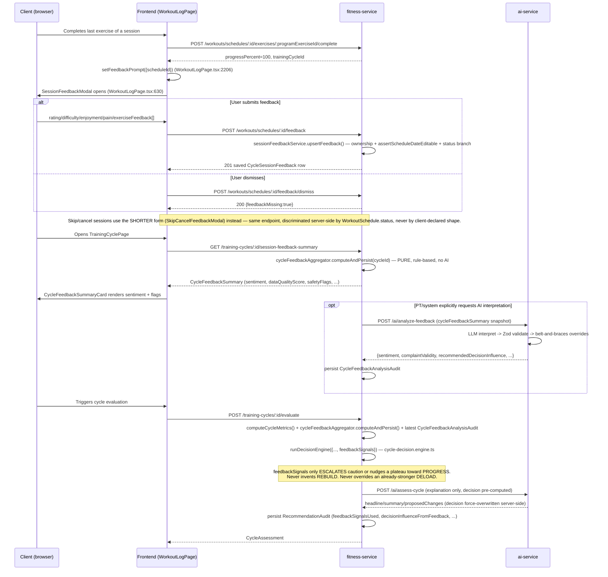

# Flow A — Session Feedback (normal user)

> Verified against the actual implementation on branch `feature/session-feedback-pt-mode` (Phases 2–5 of `docs/SESSION_FEEDBACK_AND_PT_PLAN_AUDIT.md`), not just described from the spec. File/line references point at the real code.

## Actors
- **Client** (any authenticated user with a workout schedule).
- **fitness-service** — owns `WorkoutSchedule`, `CycleSessionFeedback`, `ExerciseSessionFeedback`, `CycleFeedbackSummary`, `CycleFeedbackAnalysisAudit`, `RecommendationAudit`.
- **ai-service** — owns the feedback-interpretation LLM call (advisory only).

## End-to-end sequence

## States a session's feedback can be in

| State | Meaning | Set by |
|---|---|---|
| No row exists | Never prompted | Default |
| Row exists, `feedbackMissing=false` | User submitted real feedback | `POST .../feedback` |
| Row exists, `feedbackMissing=true` | User was prompted and explicitly dismissed | `POST .../feedback/dismiss` |
| Row has `skipReason` set | Session was SKIPPED/CANCELLED and user gave a reason | `POST .../feedback` while `WorkoutSchedule.status` is SKIPPED/CANCELLED |

`feedbackMissing` and "no row" are deliberately distinct (`session-feedback.service.ts`) — the aggregator (`cycle-feedback-aggregator.ts`) and the UI badge (`SessionFeedbackStatusRow`, `WorkoutLogPage.tsx`) both treat them the same way for display ("chưa ghi cảm nhận") but the underlying data lets a future analysis distinguish "never asked" from "asked and declined."

## Which form is used, and why

The **completion form** (`completionFeedbackSchema`) and the **skip/cancel form** (`skipCancelFeedbackSchema`) share one endpoint (`POST/PATCH /workouts/schedules/:id/feedback`) but the service picks which one applies by reading the **real** `WorkoutSchedule.status` server-side (`session-feedback.service.ts:upsertFeedback`) — never by trusting which shape the client posted. A client cannot submit a skip-form payload against a COMPLETED session or vice versa; the service throws 400 (missing required field for the actual state) or 409 (status doesn't accept feedback at all, e.g. `NOT_STARTED`).

## Data quality → decision influence, concretely

`cycle-feedback-aggregator.ts`'s `dataQualityScore = feedbackCompletionRate × min(1, feedbackSubmittedCount/3)`. Below `cycleThresholds.feedback.minimumDataQualityScore` (default 0.34, stricter 0.6 for professional/competing athletes), `cycle-decision.engine.ts`'s `applyFeedbackInfluence` refuses to let feedback move the decision at all — this is the concrete mechanism behind "missing feedback => no strong change."

## Safety invariants verified by test (not just asserted in prose)

- `cycle-feedback-aggregator.test.ts` (14 tests) — sentiment classification, safety-flag triggers, dismissed-feedback exclusion.
- `session-feedback.integration.test.ts` (10 tests) — ownership, status-gating, upsert-not-append for exercise feedback.
- `cycle-decision-feedback.engine.test.ts` (16 tests) — every rule in the table below, plus "feedback never escalates to REBUILD," "feedback never downgrades an already-stronger DELOAD."
- `feedback-analysis.test.ts` (ai-service, 12 tests) — every belt-and-braces override (low-data-quality forces `insufficient_data`/`none`; unsupported complaint forces `none`; positive-sentiment-but-high-pain forces a risk flag even if the model omitted it).

| Feedback pattern | Decision Engine effect | Test |
|---|---|---|
| "chê nặng" + rising pain + rising RPE | Escalate to DELOAD | `too_hard complaint + rising pain + increasing RPE -> escalates KEEP to DELOAD` |
| "chê dễ" + high adherence + stable RPE/volume | Upgrade to PROGRESS (never downgrades a stronger decision) | `too_easy complaint + high adherence + stable RPE/volume -> upgrades KEEP to PROGRESS` |
| Equipment complaint | Nudge to ADJUST (exercise substitution) | `equipment mismatch complaint escalates KEEP to ADJUST` |
| Boredom + good progress | Decision unchanged, scope nudged to minor_adjustment | `boredom complaint ... keeps PROGRESS decision but bumps action scope` |
| Positive sentiment + high pain | Force ADJUST/DELOAD regardless of good rating | `positive overall sentiment but high average pain forces ADJUST` |
