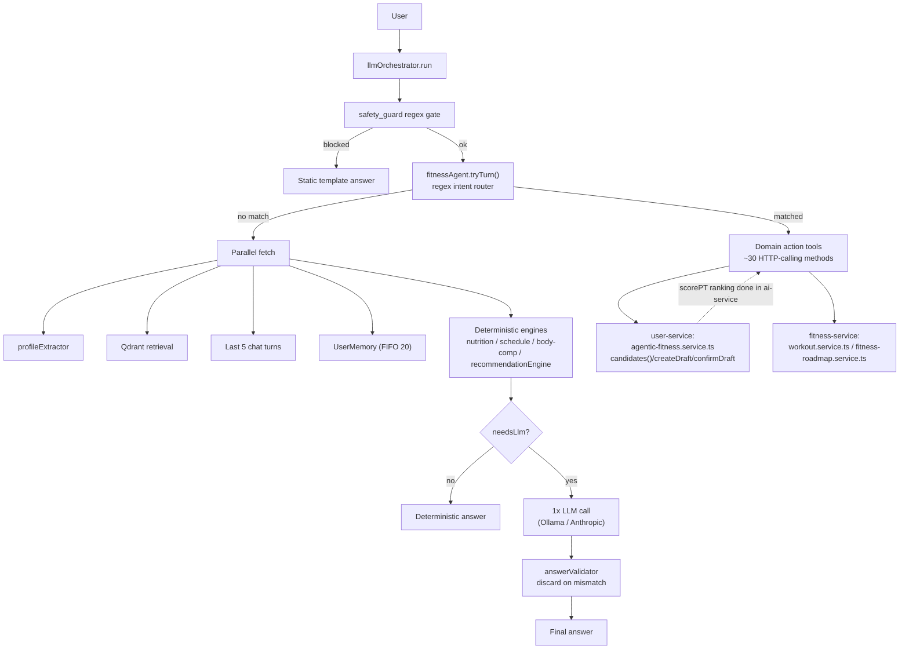
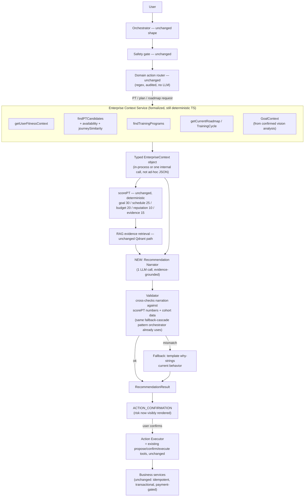
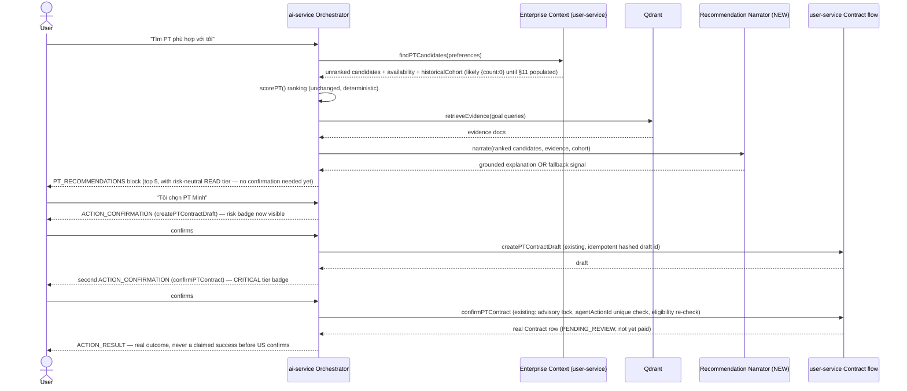
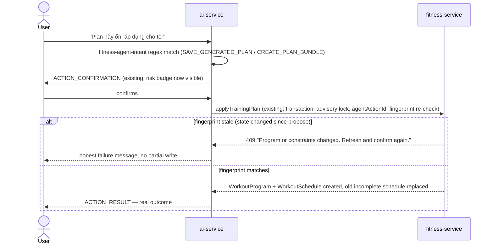
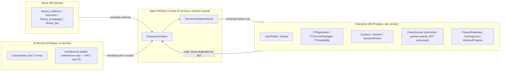

# Gymini AI Agent System — Target Architecture (TO-BE)

**Companion to:** `docs/ai-agent-system-feasibility-audit.md` (full evidence/reasoning) and `docs/ai-agent-system-migration-plan.md` (how to get here incrementally).

**Chosen architecture: Option C** — deterministic orchestrator + formalized Enterprise Context/tool layer + **one** LLM Recommendation-Narration step. Not a literal two-autonomous-agent system — see the feasibility audit §16 for why.

---

## 1. Principle (unchanged)

```
Enterprise Business System  (fitness-service, user-service, payment-service, gym-service)
        ↑  APIs / typed clients, never raw SQL
AI Integration Layer  (ai-service)
        ↑
      User
```

The AI layer never becomes the source of truth for business data. Every write it triggers goes through the existing propose→confirm→execute pattern and the existing business-service endpoints — this target architecture reuses that, it does not replace it.

---

## 2. Architecture — AS-IS



**Key AS-IS fact**: `agentic-fitness.service.ts` in user-service is already doing Enterprise-Data-Agent-shaped work (filtering + availability computation + historical similarity) — it is just not named that, and it returns an unranked list back over HTTP rather than a typed in-process object.

---

## 3. Architecture — TO-BE



**What's actually new** (shaded conceptually, everything else is the existing system, reused): the `Enterprise Context Service` formalization boundary, and the `Recommendation Narrator` + its `Validator`. Everything downstream of `RESULT` — confirmation, execution, idempotency, payment gating — is 100% the existing, already-production-grade system.

---

## 4. RAG data flow (unchanged logic, consolidation only)

```mermaid
flowchart LR
    SRC["Sources: PubMed, RSS, whitelisted web,\ncurated JSONL evidence"] --> ING["knowledge-pipeline/ ingestion\n(the ONE pipeline post-consolidation)"]
    ING --> SAFEJ["safety-judge + regex\ndetectSafetyIssue"]
    SAFEJ --> CHUNK["chunkText()\n1200 chars / 160 overlap / sentence-snap"]
    CHUNK --> META["Metadata: source_tier, trust_score,\nquality_score, evidence_level, chunk_id..."]
    META --> EMB["Ollama nomic-embed-text"]
    EMB --> QDRANT[(Qdrant: fitness_evidence /\nexercises / fitness_knowledge / fitness_faq)]
    QDRANT --> RET["retriever.ts\nquery expansion, TOP_K=5, MIN_SCORE=0.35"]
    RET --> DEDUPE["dedupe + sort by score\n(no reranking — unchanged, already performs well)"]
    DEDUPE --> AGENT["Orchestrator / Recommendation Narrator"]
```



---

## 5. Typed context objects

`[ARCHITECTURAL RECOMMENDATION]` — proposed shapes, to be defined as real TypeScript types in `backend/shared/src` (following the existing pattern of `fitness-agent-scoring.ts`, `fitness-agent.ts`):

```ts
type GoalContext = {
  // Already exactly what fitness-goal-vision.service.ts produces —
  // this is a rename/re-export, not a new schema.
  muscularity: "LOW" | "MODERATE" | "HIGH" | null;
  relativeLeanness: "MODERATE" | "LEAN_APPEARANCE" | "VERY_LEAN_APPEARANCE" | null;
  focusMuscles: Array<"SHOULDERS"|"CHEST"|"BACK"|"ARMS"|"LEGS"|"GLUTES"|"GENERAL">;
  confidence: number;
  usable: boolean;
  source: "IMAGE" | "TEXT" | "MANUAL_EDIT"; // user-confirmed, not raw model output
};

type EnterpriseContext = {
  profile: UserFitnessContext;          // existing getUserFitnessContext shape
  goalContext?: GoalContext;             // NEW: wires vision output into recommendation
  ptCandidates: PTCandidate[];           // existing findPTCandidates shape, unranked
  programCandidates: TrainingProgramCandidate[]; // existing findTrainingPrograms shape
  currentRoadmap?: RoadmapSummary;
  activeCycle?: TrainingCycleSummary;
  historicalCohort?: HistoricalSummary;  // existing summarizeJourneys shape — {count:0,...} until populated
};

type RankedRecommendation = {
  candidateId: string;
  compatibility: CompatibilityScore;     // existing scorePT output, unchanged
  evidenceUsed: EvidenceUsed[];          // existing RAG evidence shape
};

type RecommendationResult = {
  ranked: RankedRecommendation[];
  narration?: {                          // NEW — only present if the narration step ran + validated
    text: string;
    groundedIn: { compatibilityIds: string[]; evidenceIds: string[]; cohortCited: boolean };
  };
  usedNarrationFallback: boolean;        // true => template why-strings used instead (current behavior)
};

type AgentState = {
  request: { question: string; sessionId: string };
  identity: AgentIdentity;               // existing type, unchanged
  intent: ParsedIntent;                  // existing fitness-agent-intent.ts output
  enterpriseContext: EnterpriseContext;
  retrievedKnowledge: RetrievalResult;    // existing retriever.ts shape
  memories: UserMemory[];                // existing shape
  recommendation?: RecommendationResult;
  proposedAction?: AgentActionDraft;      // existing ACTION_CONFIRMATION payload shape
  trace: TraceContext;                    // existing traceLogger shape, extended (see §7)
};
```

**Design note**: every type above except `GoalContext`'s `source` field and `RecommendationResult`/`AgentState` themselves is a rename of an already-existing runtime shape — this table is a naming/typing exercise, not a rewrite.

---

## 6. Tool policy (existing tools, formal tiering)

| Tier | Definition | Examples (already-existing tools) | Execution today |
|---|---|---|---|
| READ | No state change | `getUserFitnessContext`, `findPTCandidates`, `findTrainingPrograms`, `getScientificEvidence`, `getCurrentRoadmap` | Automatic, no confirmation — correct, keep |
| DRAFT | Creates an unpersisted or short-TTL/reversible draft | `generateRoadmapDraft`, `createPTContractDraft`, `acceptRoadmapDraft` | Automatic or single confirmation — correct, keep |
| WRITE | Real, persisted business-state change, reversible/correctable | `applyTrainingPlan`, `activateRoadmap`, `advanceRoadmapPhase`, `importAiPlanToSchedule` | `ACTION_CONFIRMATION` required — correct, keep. **Add**: visible risk badge |
| CRITICAL | Financial or hard-to-reverse | `confirmPTContract` | Two-step confirmation (draft confirm → contract confirm), payment-gated — correct, keep. **Add**: visible "irreversible/financial" indicator distinct from a normal WRITE confirmation |

No tool needs to move tiers. The only change is making the tier (specifically `risk`) visible in the frontend, which today is computed (`agentActionRisk`) but discarded before reaching the UI.

---

## 7. Observability additions

Extend the existing `traceLogger`/`AiChatTiming` (do not replace):

```
requestId          — existing
sessionId, userId  — existing
agentRunId         — NEW: groups a multi-step propose→confirm→execute chain
intent             — existing (routedIntent.intent)
enterpriseContextMs — NEW: timing for the formalized context assembly
narrationUsed       — NEW: bool, did the narrator run and pass validation
narrationFallbackReason — NEW: mirrors existing fallbackReason pattern
toolSelected / toolArguments (sanitized) / toolResult — existing pattern (llm/tools.ts logging), extend to narrator's evidence selection
ragSources          — existing (evidenceUsed)
model, promptTokens, completionTokens — existing
latency             — existing (timing.totalMs)
businessAction, businessActionResult — NEW: which propose/confirm/execute call fired and its real outcome (success/409/etc.), not just "AI said so"
```

Never log raw images, raw auth headers, or full `UserMemory` content — consistent with the existing `sanitizeCoachContextForPrompt` discipline.

---

## 8. Sequence — PT recommendation + contract (Scenario 3–5 combined)



---

## 9. Sequence — Apply training plan (Scenario 6)



---

## 10. End-to-end scenarios

| # | Scenario | Agent/step invoked | Context required | Tool | RAG? | Memory? | Confirmation? | Business service | Failure handling |
|---|---|---|---|---|---|---|---|---|---|
| 1 | "Giảm mỡ, tăng cơ, tập 3 ngày/tuần" | Deterministic `recommendationEngine` + optional LLM narrative | profile | none (read-only recs) | evidence only | short-term | none (read-only) | none | deterministic fallback always available |
| 2 | Upload desired-physique photo | `fitness-goal-vision.service.ts` (existing) | none | vision analyze | no | no | user edits/confirms before persist | user-service `/profile/agent/goal` | 503 with "enter manually" if vision unavailable — existing behavior |
| 3 | "Tìm PT phù hợp với tôi" | Enterprise Context + `scorePT` + (new) Narrator | profile, goalContext if set | `findPTCandidates` | evidence | short-term | none (read-only shortlist) | user-service (read) | empty-candidate message — existing |
| 4 | "Tôi chọn PT Minh" | Domain action router | previous recommendation (session-scoped) | `createPTContractDraft` | no | session | first `ACTION_CONFIRMATION` | user-service | draft TTL 15m — existing |
| 5 | "Tôi xác nhận đăng ký PT Minh" | Domain action router | draft id | `confirmPTContract` | no | session | second `ACTION_CONFIRMATION`, CRITICAL tier | user-service → payment-service (async, webhook-gated) | 409 if PT/package no longer eligible — existing |
| 6 | "Plan này ổn, áp dụng cho tôi" | Domain action router | previewed plan (session-scoped) | `applyTrainingPlan` | no | session | `ACTION_CONFIRMATION` | fitness-service | 409 on fingerprint drift — existing |

---

## 10.5. Explicit "Hybrid Two-Agent" academic framing (added post-implementation, 2026-09-14)

For presentation/graduation-project purposes, the system now genuinely supports being described in the supervisor's original two-agent terms — **as long as the implementation detail is not glossed over**:

```
Logical Agent 1: Enterprise Data Agent
  "What is true?"
  Implementation: deterministic TypeScript —
    agenticFitnessService.candidates() (user-service) +
    fitness-agent-tools.ts (ai-service, ~30 HTTP-calling tool methods) +
    the formalized EnterpriseContext type (backend/shared/src/fitness-agent-context.ts)

Logical Agent 2: Fitness Recommendation Agent
  "What should we recommend, and why?"
  Implementation:
    deterministic ranking — scorePT() (backend/shared/src/fitness-agent-scoring.ts)
    + deterministic historical similarity — journeySimilarity()/summarizeJourneys()
    + real RAG evidence — retriever.ts / Qdrant
    + ONE bounded LLM step — recommendation_narrator.ts (narrateRecommendations)
    + a deterministic validator (validateNarration) that can reject/fall back per-candidate
```

Both "agents" are real, working code — not aspirational. Neither is an autonomous LLM reasoning loop; "Agent 2" contains the system's only new LLM capability, and it is bounded, validated, and non-blocking (§9 below). This framing is accurate to present to the supervisor: it satisfies the two-responsibility separation requested, while the underlying mechanism is the safer, cheaper, more explainable deterministic-first design the feasibility audit concluded was correct for this domain.

## 10.6. Data ownership — never interchangeable



**Rule enforced by this implementation, not just stated**: `ClientJourney` stays relational and is summarized into text at prompt-build time for the narrator — it is never embedded into Qdrant as the retrieval mechanism (feasibility audit §12, reconfirmed here since it was a real design temptation once real journey data existed).

## 11. What this target architecture deliberately does NOT include

- No second autonomous LLM agent making the PT ranking decision.
- No LLM given direct database/SQL access.
- No framework migration (LangGraph etc.).
- No new write path bypassing propose→confirm→execute.
- No vectorization of `ClientJourney`/structured enterprise data.
- No auto-confirmation of CRITICAL-tier actions under any circumstance.

This is the same system Gymini already has, with one narrow, validated LLM capability added at the one point where genuine reasoning-over-already-computed-facts adds real user value, plus the data-population and consolidation work needed to make the existing (excellent) scoring/similarity engines actually have something to work with.
## Addendum 2026-09-15 — Training Program Recommendation

Training Program Recommendation is no longer only a filter-only deferred item. The production path now uses deterministic ranking in `backend/shared/src/fitness-agent-scoring.ts::scoreTrainingProgram()` after `fitness-service` has already applied hard filters for goal, days/week, experience, safety, equipment, canonical exercises, and session duration.

The architecture mirrors Phase 4 PT narration safety:

```
WorkoutProgramTemplate candidates from fitness-service
  -> deterministic scoreTrainingProgram()
  -> server-built Program Claim Catalog
  -> optional LLM JSON selects claim IDs only
  -> deterministic renderer writes Vietnamese explanation
  -> existing applyTrainingPlan confirm path revalidates templateId + fingerprint
```

LLM still does not rank programs, calculate scores, create prescriptions, or author factual prose. Program score is compatibility only, not a predicted outcome. Full details: `docs/training-program-recommendation-audit.md`, `docs/training-program-recommendation-methodology.md`, `docs/training-program-recommendation-implementation.md`, and `docs/training-program-recommendation-evaluation.md`.

### Addendum 2026-09-15 (v2) — Codex Independent Evaluation #1 findings closed

`scoreTrainingProgram()`/`program-compatibility-v1` above is now the historical v1, kept unchanged for evaluator backward compatibility. Production uses `scoreTrainingProgramV2()`: `goal`/`experience`/`schedule`/`equipment` — already exact hard filters in `fitness-service` — are removed from the weighted score entirely and represented instead as non-weighted `eligibilityReasons` (Codex Independent Evaluation #1 measured these as constant, 0-variance, 80/100 of every v1 score). Only `sessionDuration`/`focusMuscle`/`durationWeeks` — the dimensions that can actually differ between two eligible candidates — feed `compatibility.total`. The equipment hard filter itself was also fixed to reuse the canonical `isExerciseAvailable()` REQUIRED/ALTERNATIVE/OPTIONAL predicate instead of treating every linked equipment row as required. Full detail: `docs/training-program-recommendation-v2-score-design.md`.

### Addendum 2026-09-15 (v3) — Conversational AI Coach Workflow Orchestrator

A new deterministic orchestration layer, `backend/services/ai-service/src/agent-workflow/`, sits directly in front of `fitness-agent.service.ts::tryTurn`'s existing single-turn intent dispatch (unchanged below it). It is not a second autonomous agent — it owns exactly three things: which fields a `WorkflowDefinition` requires (`SlotDefinition[]`), whether a candidate value parses (deterministic `slot-values.ts` parsers, never an LLM), and workflow transition rules (`orchestrator.ts::runWorkflowTurn`, a plain state machine over a new `AgentWorkflowSession` row). Everything else — ranking, claim catalogs, memory provenance, the PT contract two-step, `applyTrainingPlan` idempotency — is reused completely unchanged; the orchestrator's only job is gating entry and, once every required slot resolves, falling through to the existing `ACTION_CONFIRMATION`/`FitnessAgentAction` machinery this document already describes in §8–9.

```
User message
  -> tryTurn: ownSession() -> runWorkflowTurn(question, intent.kind)
       no active workflow, intent gates a WorkflowDefinition
         -> ask ONLY the missing required slots (EnterpriseContext-resolved
            first — never re-ask a known value)
       active workflow, expected slot pending
         -> interpret THIS reply as that slot's answer first (before any
            generic intent routing); PROFILE_FACT changes require an
            explicit confirm card (old -> new, persistence scope) with
            ZERO writes before confirm
       every required slot now known/confirmed
         -> AgentWorkflowSession marked COMPLETED, EnterpriseContext
            re-read, and the ORIGINAL intent (CREATE_PLAN_BUNDLE/PT/
            PROGRAM) automatically resumes — the user is never asked to
            repeat their request
  -> falls through to the existing dispatch chain, 100% unchanged
       (proposePlanBundle / PT+PROGRAM recommendation / etc.)
```

A `CREATE_PLAN_BUNDLE` roadmap draft that is still PENDING confirmation can also be revised in plain language ("Phase đầu nhẹ hơn một chút") — this reuses `generateAiRoadmapDraftSchema.constraints` (a pre-existing field already rendered into the roadmap-generation prompt), regenerating the SAME pending action's draft rather than creating a second one; the active roadmap is never touched by a revision.

Business facts this layer resolves (goal/age/height/weight/gender) are written through the real `PUT /profile/me` endpoint via an explicit `.strict()` field whitelist — never a generic PATCH, never AI long-term memory. `AgentWorkflowSession` itself stores only workflow progress (expected slot, workflow-local scratch values, status), never a competing copy of `UserProfile`/`FitnessRoadmap`/business truth. Full detail, including three real bugs this design caught and fixed via DB-backed testing before shipping: `docs/conversational-ai-coach-workflow-audit.md`, `-design.md`, `-implementation.md`, `-evaluation.md`.

### Addendum 2026-09-16 — Remediation #1 (Codex Independent Evaluation #1)

An independent Codex review of the layer above found two release-blocking issues neither this session's own tests nor the design caught: a `PROFILE_FACT` slot (e.g. `targetWeight`) accepted "just use it once, don't save" even though downstream generation always re-reads the real profile (so the value would silently vanish), and a target weight with no relationship to the user's real height (e.g. 30kg at 180cm) could be confirmed and written with no contextual safety check — only a flat 25-300kg absolute-range check existed anywhere in the codebase. Both are fixed: slot persistence tier now server-side gates which confirmation replies are even legal (`allowsUseOnce`), and a new, minimal, WHO-BMI-floor-based contextual validator (`target-weight-safety.ts`) runs both when a value is first offered and again with freshly reloaded context immediately before it is written. Four further real gaps (a rich initial message's values being ignored, a spoken correction like "không, 70kg" being misread as a decline, no database-level guarantee against two concurrent active workflows, and Vietnamese thousands-notation budgets like "1.500.000" being misparsed) were fixed the same way — deterministically, without introducing an LLM extractor. Full detail: `docs/conversational-ai-coach-remediation-1.md`.

### Addendum 2026-09-16 — Final Safety Closure (Codex Independent Evaluation #2)

A second independent review found one remaining HIGH the first remediation's own contextual validator missed by construction, not by oversight: `target-weight-safety.ts`'s "never block on missing data" rule means a candidate arriving before OTHER required context (e.g. a target weight stated before current weight) is correctly accepted as provisional — but nothing then re-checked it once that missing context later arrived, so an unsafe value could still reach the user-facing confirmation card (the actual database write was already blocked by the existing pre-write check, but the card itself should never have offered it). Fixed with a third, generic validation stage in `finalizeWorkflow()`: once every required slot is known, every slot carrying a contextual validator is re-checked against that now-complete picture before any confirmation is built; a rejection removes just that value and asks for it again, keeping everything else already known. Re-run of Codex's own evaluator: 30/30 passing, zero failures. Full detail: `docs/conversational-ai-coach-safety-closure.md`.

### Addendum 2026-09-18 — Standalone CREATE_WORKOUT_PLAN / CREATE_NUTRITION_PLAN

Two new, additive `WorkflowDefinition`s were registered on top of the same orchestrator, with zero changes to `orchestrator.ts`/`types.ts` themselves. `CREATE_WORKOUT_PLAN` collects only `daysPerWeek`/`sessionMinutes` (both `WORKFLOW_ONLY`, EnterpriseContext-resolved first, exactly like every other slot in this layer) and, once resolved, generates a fresh structured draft by reusing `recommendation_engine.ts` + real exercise-catalog resolution (the SAME pipeline `SAVE_GENERATED_PLAN` already trusted) — never a fourth generation mechanism. `CREATE_NUTRITION_PLAN` collects only `mealsPerDay` and, once resolved, queues the SAME real async nutrition-generation job the REST "AI Nutrition Plan" wizard already uses; because that job can take up to ~3 minutes and every chat turn is synchronous, its GENERATING → PREVIEW → FAILED lifecycle is tracked entirely inside the (already-established) `FitnessAgentAction.payload`, polled on the user's next turn — this needed no new `WorkflowStatus` wired into the orchestrator's own state machine, even though several such values had been reserved for exactly this earlier. Both new workflows produce a structured preview (`WORKOUT_PLAN_PREVIEW`/`NUTRITION_PLAN_PREVIEW`), support a genuine conversational revision loop that edits the DRAFT only (never a business write), and persist through the SAME existing authoritative boundaries (`importAiPlanToSchedule` / `/nutrition/from-ai-plan`) every other real write in this file already uses. A real, disclosed gap was found (not fixed) in the REST nutrition wizard's own "adjust" endpoint — its `notes` param is silently dropped before reaching the LLM prompt; this chat revision loop routes constraints through the `restrictions` field instead, which is genuinely consumed. Full detail: `docs/standalone-workout-workflow-{audit,design,evaluation}.md`, `docs/standalone-nutrition-workflow-{audit,design,evaluation}.md`, `docs/ai-coach-product-capability-completion.md`.

### Addendum 2026-09-19 — Product remediation #1 (Codex product E2E findings M1–M7, L1)

An independent product E2E review of the two standalone capabilities found seven product-semantic defects (no critical/high) that stubbed-boundary tests had hidden; the foundation itself stayed signed off. Fixes stay inside the product layer. **Nutrition target authority**: the standalone plan is generated against the user's ACTIVE `NutritionGoal`, else the same deterministic initial prescription onboarding computes (a new read-only `GET /nutrition/target-preview` in fitness-service sharing bootstrap's input assembly — no new formula); the LLM proposes food composition only; confirm re-resolves the target and content hash and fails closed. **Enforced food exclusions**: user-declared exclusions become canonical keys (`nutrition-food-constraints.ts`) that filter the processor's food pool at the source and are re-checked on the final plan and before preview; unsupported phrases are refused, never downgraded to prompt hints; soft preferences stay prompt-only and are labelled as such. **Constraint continuity**: a non-required `WORKFLOW_ONLY` slot carries opening-message constraints across slot collection; constraints merge, never replace. **Pending-draft routing**: `routePendingDraftTurn` selects which pending draft (roadmap bundle / workout / nutrition) owns a turn — explicit domain cue, else the most recently touched draft not displaced by another task, else ask — separate from (and without touching) the signed-off one-active-workflow invariant. **Workout fidelity**: the reviewed weekday pattern (`selectedWeekdays`) reaches `importAiPlanToSchedule`; exclusions are durable per draft; generated plans still only WARN (no template-style hard eligibility gate). Full detail: `docs/ai-coach-product-remediation-1.md`.

### Addendum 2026-09-19 — Product final remediation (3 MEDIUM)

Three product invariants were made explicit without touching the orchestrator: (1) an accumulating user constraint set is merged at the product layer on every collecting turn (the orchestrator's never-overwrite rule remains correct for scalar slots); (2) every declared hard exclusion is either enforceable or explicitly refused — no clause of a compound message is silently accepted; (3) `FitnessAgentAction` `CANCELLED` is terminal — the common `execute()` entry only runs `PENDING` actions and returns stored results for `COMPLETED`. Detail: `docs/ai-coach-product-final-remediation.md`.

### Addendum 2026-09-19 — Finalization race closure

`FitnessAgentAction` finalization is now decided at one atomic database boundary: confirm (`PENDING -> EXECUTING`) and dismiss (`PENDING -> CANCELLED`) are single conditional UPDATEs, so exactly one terminal direction wins across processes; no transaction spans the business HTTP call; failures return the action to `PENDING`; stale `EXECUTING` claims are reclaimable and made safe by downstream idempotency. Detail: `docs/ai-coach-finalization-race-closure.md`.
