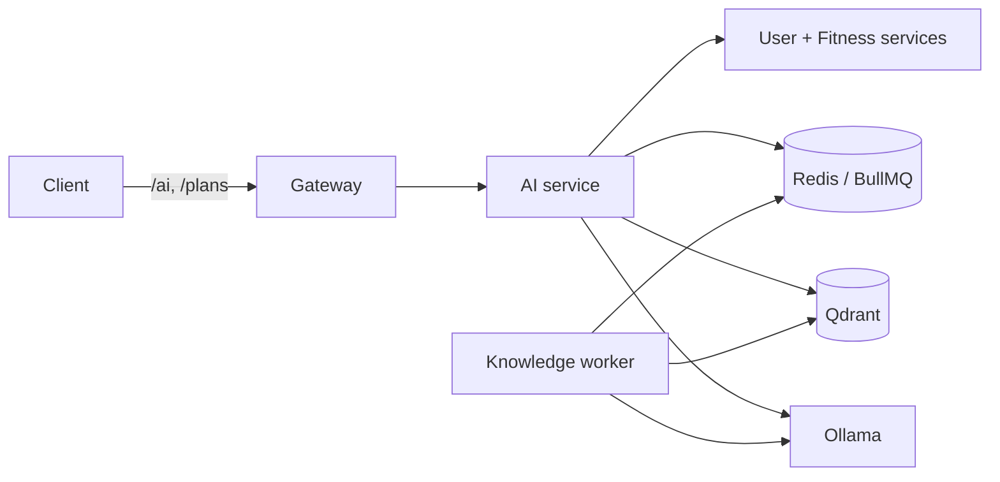

# AI Service Operations

This is the canonical runtime guide for `backend/services/ai-service` and the
optional `knowledge-worker`. General Docker setup belongs in
[`docs/setup/README.md`](setup/README.md).

## Runtime Contract

| Setting | Development default | Purpose |
| --- | --- | --- |
| `LLM_PROVIDER` | `ollama` | Completion provider |
| `LLM_BASE_URL` | `http://host.docker.internal:11434` | Ollama endpoint used by AI runtime and embeddings |
| `OLLAMA_BASE_URL` | same as `LLM_BASE_URL` | Compatibility setting used by supporting scripts |
| `LLM_MODEL` | `fitness-coach-qwen2.5-1.5b:q4_K_M` | Chat, JSON generation, plans, and tool calls |
| `EMBEDDING_MODEL` | `nomic-embed-text` | RAG and knowledge-ingestion embeddings |
| `EMBEDDING_DIMENSIONS` | `768` | Qdrant vector size |
| `LLM_TIMEOUT_MS` | `300000` | General completion timeout |
| `EMBEDDING_TIMEOUT_MS` | `120000` | Embedding timeout |
| `LLM_NUM_CTX` | `8192` | Normal chat context limit |
| `LLM_JSON_NUM_CTX` | `8192` | Structured-output context limit |

The chat model must never be used as the embedding model. `nomic-embed-text`
is used for retrieval, evidence indexing, and knowledge ingestion regardless of
which compatible chat model is selected.

## Request Flow



The browser calls the gateway. AI chat enriches the request with user and
fitness context, retrieves relevant documents, then calls the LLM. Plan jobs use
BullMQ. Retrieval or LLM failure can produce a deterministic fallback; inspect
response metadata and logs before treating a short answer as a model result.

## Ollama Connectivity

Verify Ollama on Windows:

```powershell
Invoke-RestMethod http://127.0.0.1:11434/api/tags
```

Verify the same endpoint from Docker:

```powershell
docker run --rm curlimages/curl:latest http://host.docker.internal:11434/api/tags
```

Verify from the AI container:

```powershell
docker compose -f infra/compose/docker-compose.dev.yml exec ai-service sh -lc "wget -qO- http://host.docker.internal:11434/api/tags"
```

For a private remote tunnel, change both base URLs to the tunnel port exposed on
the Windows host, for example `http://host.docker.internal:11435`. Keep SSH
credentials and the tunnel process outside the repository.

## Health Checks

```powershell
Invoke-RestMethod http://localhost:3003/health
Invoke-RestMethod http://localhost:3000/health
docker compose -f infra/compose/docker-compose.dev.yml ps
```

The Ollama health check reads `/api/tags` and verifies that both `LLM_MODEL` and
`EMBEDDING_MODEL` exist. Model names are matched with or without `:latest`, so
`nomic-embed-text` and `nomic-embed-text:latest` are equivalent.

Useful diagnostics:

```powershell
pnpm --filter @gym-coach/ai-service run ai:check:ollama
pnpm --filter @gym-coach/ai-service run ai:warmup
pnpm --filter @gym-coach/ai-service run ai:check:rag
pnpm --filter @gym-coach/ai-service run ai:debug:chat -- "Phan tich InBody moi nhat cua toi"
```

## RAG Boundaries

| Collection | Used for |
| --- | --- |
| `exercises` | Semantic exercise search in AI chat |
| `fitness_knowledge` | General training and nutrition knowledge |
| `fitness_faq` | Curated question/answer retrieval |
| `fitness_evidence` | Evidence metadata used by body-composition and plan reasoning |

Workout-plan generation selects real exercises through the Fitness Service
catalog, not from Qdrant. Qdrant enriches reasoning and chat; it is not the
source of truth for exercise IDs or user workout state.

Inspect Qdrant:

```powershell
Invoke-RestMethod http://localhost:6333/collections
Invoke-RestMethod http://localhost:6333/collections/fitness_evidence
```

## Ingestion And Evaluation

Run from the repository root:

```powershell
pnpm --filter @gym-coach/ai-service run data:validate
pnpm --filter @gym-coach/ai-service run data:ingest
pnpm --filter @gym-coach/ai-service run ingest:training-methods
pnpm --filter @gym-coach/ai-service run ai:test:rag
pnpm --filter @gym-coach/ai-service run ai:eval:retrieval
pnpm --filter @gym-coach/ai-service run ai:test:evidence
pnpm --filter @gym-coach/ai-service run ai:test:plan-evidence
```

`data:ingest` and `ai:reindex` write embeddings to Qdrant. They do not train or
modify model weights.

## Knowledge Worker

Start the optional worker with the same model and URL configuration as the AI
service:

```powershell
docker compose -f infra/compose/docker-compose.dev.yml --profile knowledge up -d knowledge-worker
docker compose -f infra/compose/docker-compose.dev.yml logs -f knowledge-worker
```

Manual commands:

```powershell
pnpm --filter @gym-coach/ai-service run knowledge:pipeline
pnpm --filter @gym-coach/ai-service run knowledge:pubmed
pnpm --filter @gym-coach/ai-service run knowledge:rss
pnpm --filter @gym-coach/ai-service run knowledge:web
pnpm --filter @gym-coach/ai-service run knowledge:test-rag
```

Research automation is opt-in and review-aware:

```powershell
pnpm --filter @gym-coach/ai-service run knowledge:research:dry-run
pnpm --filter @gym-coach/ai-service run knowledge:research:fetch
pnpm --filter @gym-coach/ai-service run knowledge:research:eval
pnpm --filter @gym-coach/ai-service run knowledge:research:index
```

Review `data/research_review_queue.jsonl` before indexing records that require
approval. External research fetches should remain disabled in normal CI.

## Plan Generation

Workout and nutrition plans are asynchronous. The API creates a job, the AI
worker generates and validates structured JSON, and clients poll the job status.

Important settings:

- `AI_PLAN_TIMEOUT_MS`: first plan-generation attempt
- `AI_PLAN_RETRY_TIMEOUT_MS`: repair/retry attempt
- `AI_PLAN_NUM_PREDICT`: optional fixed token override
- `AI_PLAN_RETRY_NUM_PREDICT`: optional retry override

Leave token overrides unset unless diagnosing a specific model. The worker uses
a size-aware budget based on requested training days and exercises per day.

## Chat Performance And Fallbacks

AI chat has separate budgets for context, retrieval, evidence, and generation.
The main overrides are:

- `AI_CHAT_CONTEXT_TIMEOUT_MS`
- `AI_CHAT_RAG_TIMEOUT_MS`
- `AI_CHAT_EVIDENCE_TIMEOUT_MS`
- `AI_CHAT_LLM_TIMEOUT_MS`
- `RAG_EMBEDDING_TIMEOUT_MS`

Structured timing logs include the request `traceId`, total time, context time,
retrieval time, prompt-build time, generation time, and validation time. They
must not include tokens, credentials, full prompts, or raw health profiles.

When the UI says that a detailed LLM response is unavailable, check in order:

1. `/health` and the reported model names
2. AI logs for timeout, missing model, or provider errors
3. Qdrant collection availability
4. downstream User/Fitness service health
5. whether the response marks `usedFallback` or a `fallbackReason`

## Logs And Database Inspection

```powershell
docker compose -f infra/compose/docker-compose.dev.yml logs --tail=200 ai-service
docker compose -f infra/compose/docker-compose.dev.yml logs -f ai-service
docker compose -f infra/compose/docker-compose.dev.yml exec redis redis-cli --scan --pattern "bull:ai-tasks*"
docker compose -f infra/compose/docker-compose.dev.yml exec postgres psql -U gymcoach -d gymcoach_ai -c "select id, user_id, status, job_id, fail_reason, created_at from workout_plans order by created_at desc limit 20;"
docker compose -f infra/compose/docker-compose.dev.yml exec postgres psql -U gymcoach -d gymcoach_ai -c "select created_at, route_intent, response_time, used_fallback, left(question, 100) from conversations order by created_at desc limit 20;"
```

## Verification

```powershell
pnpm --filter @gym-coach/ai-service run build
pnpm --filter @gym-coach/ai-service test
pnpm --filter @gym-coach/ai-service run test:all
pnpm --filter @gym-coach/ai-service run test:policy
pnpm --filter @gym-coach/ai-service run test:evaluation
```

Use `pnpm docker:test:fast` for normal repository verification and
`pnpm docker:test:full` for isolated Postgres, Redis, and Qdrant. Real Ollama is
explicitly opt-in in the Docker test stack.

## Rollback And Recovery

- Configuration rollback: restore the previous `LLM_*`, `OLLAMA_*`, and
  `EMBEDDING_*` values, then recreate `ai-service` and `knowledge-worker`.
- Bad knowledge batch: stop the worker, keep the JSONL review record for audit,
  remove only the affected Qdrant points or restore a Qdrant snapshot, then run
  retrieval evaluation.
- Queue issue: inspect BullMQ keys and job records before deleting anything.
- Full local reset: follow the volume warning in `docs/setup/README.md`; it
  deletes all development databases and indexes.
