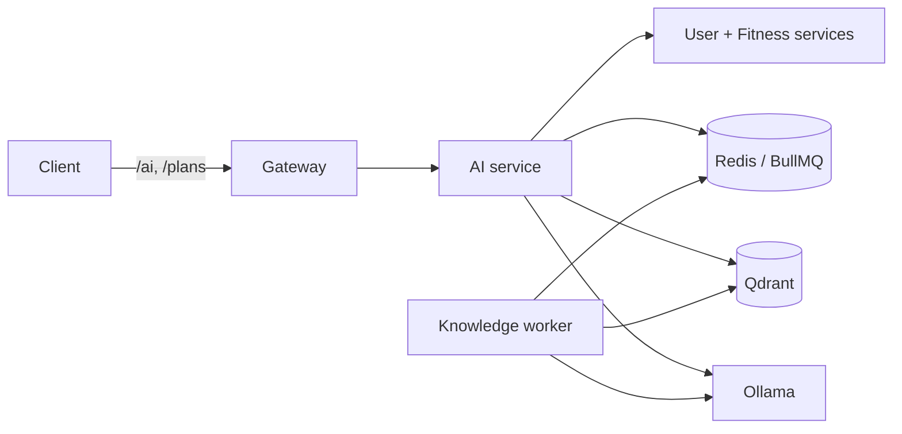

# AI Service Operations

This is the canonical runtime guide for `backend/services/ai-service` and the
optional `knowledge-worker`. General Docker setup belongs in
[`docs/setup/README.md`](setup/README.md).

## Runtime Contract

| Setting | Development default | Purpose |
| --- | --- | --- |
| `LLM_PROVIDER` | `ollama` | Completion provider |
| `LLM_BASE_URL` | `http://host.docker.internal:11434` | Ollama endpoint used by AI runtime and embeddings |
| `OLLAMA_BASE_URL` | same as `LLM_BASE_URL` | Compatibility setting used by supporting scripts |
| `LLM_MODEL` | `fitness-coach-qwen2.5-1.5b:q4_K_M` | Chat, JSON generation, plans, and tool calls |
| `EMBEDDING_MODEL` | `nomic-embed-text` | RAG and knowledge-ingestion embeddings |
| `EMBEDDING_DIMENSIONS` | `768` | Qdrant vector size |
| `LLM_TIMEOUT_MS` | `300000` | General completion timeout |
| `EMBEDDING_TIMEOUT_MS` | `120000` | Embedding timeout |
| `LLM_NUM_CTX` | `8192` | Normal chat context limit |
| `LLM_JSON_NUM_CTX` | `8192` | Structured-output context limit |

The chat model must never be used as the embedding model. `nomic-embed-text`
is used for retrieval, evidence indexing, and knowledge ingestion regardless of
which compatible chat model is selected.

## Request Flow



The browser calls the gateway. AI chat enriches the request with user and
fitness context, retrieves relevant documents, then calls the LLM. Plan jobs use
BullMQ. Retrieval or LLM failure can produce a deterministic fallback; inspect
response metadata and logs before treating a short answer as a model result.

## Ollama Connectivity

Verify Ollama on Windows:

```powershell
Invoke-RestMethod http://127.0.0.1:11434/api/tags
```

Verify the same endpoint from Docker:

```powershell
docker run --rm curlimages/curl:latest http://host.docker.internal:11434/api/tags
```

Verify from the AI container:

```powershell
docker compose -f infra/compose/docker-compose.dev.yml exec ai-service sh -lc "wget -qO- http://host.docker.internal:11434/api/tags"
```

For a private remote tunnel, change both base URLs to the tunnel port exposed on
the Windows host, for example `http://host.docker.internal:11435`. Keep SSH
credentials and the tunnel process outside the repository.

## Health Checks

```powershell
Invoke-RestMethod http://localhost:3003/health
Invoke-RestMethod http://localhost:3000/health
docker compose -f infra/compose/docker-compose.dev.yml ps
```

The Ollama health check reads `/api/tags` and verifies that both `LLM_MODEL` and
`EMBEDDING_MODEL` exist. Model names are matched with or without `:latest`, so
`nomic-embed-text` and `nomic-embed-text:latest` are equivalent.

Useful diagnostics:

```powershell
pnpm --filter @gym-coach/ai-service run ai:check:ollama
pnpm --filter @gym-coach/ai-service run ai:warmup
pnpm --filter @gym-coach/ai-service run ai:check:rag
pnpm --filter @gym-coach/ai-service run ai:debug:chat -- "Phan tich InBody moi nhat cua toi"
```

## RAG Boundaries

| Collection | Used for |
| --- | --- |
| `exercises` | Semantic exercise search in AI chat |
| `fitness_knowledge` | General training and nutrition knowledge |
| `fitness_faq` | Curated question/answer retrieval |
| `fitness_evidence` | Evidence metadata used by body-composition and plan reasoning |

Workout-plan generation selects real exercises through the Fitness Service
catalog, not from Qdrant. Qdrant enriches reasoning and chat; it is not the
source of truth for exercise IDs or user workout state.

Inspect Qdrant:

```powershell
Invoke-RestMethod http://localhost:6333/collections
Invoke-RestMethod http://localhost:6333/collections/fitness_evidence
```

## Ingestion And Evaluation

Run from the repository root:

```powershell
pnpm --filter @gym-coach/ai-service run data:validate
pnpm --filter @gym-coach/ai-service run data:ingest
pnpm --filter @gym-coach/ai-service run ingest:training-methods
pnpm --filter @gym-coach/ai-service run ai:test:rag
pnpm --filter @gym-coach/ai-service run ai:eval:retrieval
pnpm --filter @gym-coach/ai-service run ai:test:evidence
pnpm --filter @gym-coach/ai-service run ai:test:plan-evidence
```

`data:ingest` and `ai:reindex` write embeddings to Qdrant. They do not train or
modify model weights.

## Knowledge Worker

Start the optional worker with the same model and URL configuration as the AI
service:

```powershell
docker compose -f infra/compose/docker-compose.dev.yml --profile knowledge up -d knowledge-worker
docker compose -f infra/compose/docker-compose.dev.yml logs -f knowledge-worker
```

Manual commands:

```powershell
pnpm --filter @gym-coach/ai-service run knowledge:pipeline
pnpm --filter @gym-coach/ai-service run knowledge:pubmed
pnpm --filter @gym-coach/ai-service run knowledge:rss
pnpm --filter @gym-coach/ai-service run knowledge:web
pnpm --filter @gym-coach/ai-service run knowledge:test-rag
```

Research automation is opt-in and review-aware:

```powershell
pnpm --filter @gym-coach/ai-service run knowledge:research:dry-run
pnpm --filter @gym-coach/ai-service run knowledge:research:fetch
pnpm --filter @gym-coach/ai-service run knowledge:research:eval
pnpm --filter @gym-coach/ai-service run knowledge:research:index
```

Review `data/research_review_queue.jsonl` before indexing records that require
approval. External research fetches should remain disabled in normal CI.

## Plan Generation

Workout and nutrition plans are asynchronous. The API creates a job, the AI
worker generates and validates structured JSON, and clients poll the job status.

Important settings:

- `AI_PLAN_TIMEOUT_MS`: first plan-generation attempt
- `AI_PLAN_RETRY_TIMEOUT_MS`: repair/retry attempt
- `AI_PLAN_NUM_PREDICT`: optional fixed token override
- `AI_PLAN_RETRY_NUM_PREDICT`: optional retry override

Leave token overrides unset unless diagnosing a specific model. The worker uses
a size-aware budget based on requested training days and exercises per day.

## Chat Performance And Fallbacks

AI chat has separate budgets for context, retrieval, evidence, and generation.
The main overrides are:

- `AI_CHAT_CONTEXT_TIMEOUT_MS`
- `AI_CHAT_RAG_TIMEOUT_MS`
- `AI_CHAT_EVIDENCE_TIMEOUT_MS`
- `AI_CHAT_LLM_TIMEOUT_MS`
- `RAG_EMBEDDING_TIMEOUT_MS`

Structured timing logs include the request `traceId`, total time, context time,
retrieval time, prompt-build time, generation time, and validation time. They
must not include tokens, credentials, full prompts, or raw health profiles.

When the UI says that a detailed LLM response is unavailable, check in order:

1. `/health` and the reported model names
2. AI logs for timeout, missing model, or provider errors
3. Qdrant collection availability
4. downstream User/Fitness service health
5. whether the response marks `usedFallback` or a `fallbackReason`

## Logs And Database Inspection

```powershell
docker compose -f infra/compose/docker-compose.dev.yml logs --tail=200 ai-service
docker compose -f infra/compose/docker-compose.dev.yml logs -f ai-service
docker compose -f infra/compose/docker-compose.dev.yml exec redis redis-cli --scan --pattern "bull:ai-tasks*"
docker compose -f infra/compose/docker-compose.dev.yml exec postgres psql -U gymcoach -d gymcoach_ai -c "select id, user_id, status, job_id, fail_reason, created_at from workout_plans order by created_at desc limit 20;"
docker compose -f infra/compose/docker-compose.dev.yml exec postgres psql -U gymcoach -d gymcoach_ai -c "select created_at, route_intent, response_time, used_fallback, left(question, 100) from conversations order by created_at desc limit 20;"
```

## Verification

```powershell
pnpm --filter @gym-coach/ai-service run build
pnpm --filter @gym-coach/ai-service test
pnpm --filter @gym-coach/ai-service run test:all
pnpm --filter @gym-coach/ai-service run test:policy
pnpm --filter @gym-coach/ai-service run test:evaluation
```

Use `pnpm docker:test:fast` for normal repository verification and
`pnpm docker:test:full` for isolated Postgres, Redis, and Qdrant. Real Ollama is
explicitly opt-in in the Docker test stack.

## Rollback And Recovery

- Configuration rollback: restore the previous `LLM_*`, `OLLAMA_*`, and
  `EMBEDDING_*` values, then recreate `ai-service` and `knowledge-worker`.
- Bad knowledge batch: stop the worker, keep the JSONL review record for audit,
  remove only the affected Qdrant points or restore a Qdrant snapshot, then run
  retrieval evaluation.
- Queue issue: inspect BullMQ keys and job records before deleting anything.
- Full local reset: follow the volume warning in `docs/setup/README.md`; it
  deletes all development databases and indexes.

---

<a id="merged-ai-chat-performance-audit"></a>

## Consolidated reference: ai-chat-performance-audit.md

> Consolidated 2026-09-07. Original dates, verification results and deployment
> snapshots below are historical; confirm them against current code/environment.

## AI Chat Performance Audit

Scope: AI Coach chat latency for requests such as `Phan tich InBody moi nhat cua toi`.

Status: current diagnostic reference. Runtime defaults come from
`infra/compose/docker-compose.dev.yml` and `.env.example`.

### Request Flow

Frontend:

- `frontend/web/src/app/pages/client/AICoachPage.tsx`
- `frontend/web/src/app/stores/pendingAiTasks.ts`
- `frontend/web/src/app/services/api.ts`
- Streaming endpoint: `POST /ai/ask/stream`
- Non-stream fallback endpoint: `POST /ai/ask`

Gateway:

- `backend/gateway/src/routes/proxy.routes.ts`
- Generic AI proxy timeout is longer than the AI service internal timeout.
- Streaming chat is proxied as an SSE request.

AI service:

- Route/controller: `backend/services/ai-service/src/controllers/ai.controller.ts`
- Service wrapper: `backend/services/ai-service/src/services/rag.service.ts`
- Orchestration: `backend/services/ai-service/src/llm/orchestrator.service.ts`
- Context: `profile_extractor.ts`, workout/nutrition context resolvers
- Retrieval: `retriever.ts` -> Qdrant
- Generation: `llm.service.ts` -> Ollama
- Validation/fallback: `answer_validator.ts`, deterministic formatter

### Main Latency Risks

- Ollama cold start or missing `LLM_MODEL`.
- Embedding model cold start or missing `EMBEDDING_MODEL`.
- RAG query expansion creating multiple embedding calls.
- Qdrant missing collections or slow search.
- Downstream profile/InBody/workout/nutrition context calls.
- Long prompt generation on local CPU.

### Timeouts And Fallbacks

Default limits:

- Profile/context fetch: `AI_CHAT_CONTEXT_TIMEOUT_MS`, default `5000`.
- RAG retrieval: `AI_CHAT_RAG_TIMEOUT_MS`, default `8000`.
- Body-composition evidence: `AI_CHAT_EVIDENCE_TIMEOUT_MS`, default `8000`.
- Embedding call: `RAG_EMBEDDING_TIMEOUT_MS` or `EMBEDDING_TIMEOUT_MS`;
  Compose defaults to `120000` for the host Ollama runtime.
- LLM generation: `AI_CHAT_LLM_TIMEOUT_MS` or `LLM_TIMEOUT_MS`; Compose defaults
  to `300000`. Use a shorter chat-specific override only when fast fallback is
  more important than allowing a cold model to finish.
- Frontend stream timeout: `75000`.

Fallback policy:

- Context failure: continue with empty profile context and log `profile_context_unavailable`.
- RAG failure: continue without retrieved context and log `rag_unavailable`.
- Evidence failure: continue without evidence enrichment and log `evidence_unavailable`.
- Nutrition context failure/timeout: return a short localized fallback and log `nutrition_context_unavailable`.
- Workout schedule context failure/timeout: return a short localized fallback and log `workout_schedule_context_unavailable`.
- Generic LLM failure/timeout: return a deterministic user-facing fallback and set `fallbackReason=llm_unavailable`.
- InBody/body-composition LLM timeout with deterministic body-composition text available: return deterministic body-composition analysis and set `fallbackReason=llm_timeout_deterministic_body_comp`.

### Observability

Each AI chat request includes a `traceId` used as `request_id` in logs.

Structured timing fields:

- `totalMs`
- `profileContextMs`
- `ragTotalMs`
- `chatHistoryMs`
- `scheduleContextMs`
- `nutritionContextMs`
- `evidenceMs`
- `promptBuildMs`
- `llmGenerateMs`
- `validationMs`

The timing log intentionally does not include email, token, full prompt, full chat, or raw health/body-composition data.

### Debug Commands

```bash
pnpm --filter @gym-coach/ai-service run build
pnpm --filter @gym-coach/ai-service run ai:check:ollama
pnpm --filter @gym-coach/ai-service run ai:warmup
pnpm --filter @gym-coach/ai-service run ai:check:rag
pnpm --filter @gym-coach/ai-service run ai:debug:chat -- "Phan tich InBody moi nhat cua toi"
```

If Ollama models are missing:

```bash
ollama list
ollama pull nomic-embed-text
```

If RAG collections are missing:

```bash
pnpm --filter @gym-coach/ai-service run ai:test:seed-rag
pnpm --filter @gym-coach/ai-service run ai:reindex
```


---

<a id="merged-ai-knowledge-automation"></a>

## Consolidated reference: ai-knowledge-automation.md

> Consolidated 2026-09-07. Original dates, verification results and deployment
> snapshots below are historical; confirm them against current code/environment.

## AI Knowledge Automation

This project uses Ollama + Qdrant + RAG as the primary knowledge architecture.
Research automation is an evidence refresh pipeline. It is not fine-tuning and it
never trains model weights.

### What It Does

- Reads configured research topics.
- Uses allowlisted API connectors such as PubMed, Crossref, and OpenAlex.
- Normalizes metadata into a common schema.
- Deduplicates by DOI, PMID, normalized title, and content hash.
- Scores evidence with transparent reasons.
- Sends low-trust or web records to a local review queue.
- Indexes approved/high-confidence chunks into Qdrant `fitness_evidence`.

### What It Does Not Do

- It does not scrape random websites.
- It does not bypass robots.txt.
- It does not copy full text unless source/license allow it.
- It does not run continuously by default.
- It does not train or fine-tune a model.

### Allowed Sources

Configured in `backend/services/ai-service/src/knowledge/source_registry.ts`:

- PubMed metadata and abstracts.
- PubMed Central open access metadata when appropriate.
- Crossref metadata.
- OpenAlex metadata.
- Manual official guideline summaries.
- Webpage connector only when explicitly allowlisted and robots.txt permits.

### Commands

Dry-run, no writes:

```bash
cd backend/services/ai-service
pnpm run knowledge:research:dry-run
```

Fetch metadata and normalized records, no Qdrant write:

```bash
pnpm run knowledge:research:fetch
```

Review queue:

```text
data/research_review_queue.jsonl
```

Set `status` to `approved` or `rejected` for records needing review.

Index approved/high-confidence records into Qdrant:

```bash
pnpm run knowledge:research:index
```

Offline eval of normalized research metadata:

```bash
pnpm run knowledge:research:eval
```

Then run retrieval eval:

```bash
pnpm run ai:test:rag
pnpm run ai:eval:retrieval
```

### Automation

No background crawler runs by default. Scheduler only runs when:

```bash
ENABLE_RESEARCH_AUTOMATION=true
```

Optional env:

```bash
RESEARCH_AUTOMATION_CRON="0 3 * * 0"
RESEARCH_MAX_RESULTS_PER_TOPIC=5
RESEARCH_MIN_YEAR=2015
RESEARCH_REQUIRE_REVIEW_FOR_WEB=true
RESEARCH_CONTACT_EMAIL=you@example.com
PUBMED_API_KEY=
CROSSREF_MAILTO=you@example.com
RESEARCH_USER_AGENT="FitnessAssistantResearchBot/1.0"
RESEARCH_WEB_ALLOWLIST="example.org"
```

### Rollback

If a bad batch is indexed:

1. Stop automation.
2. Keep the normalized JSONL and review queue entry for audit.
3. Delete Qdrant points by `source_type=research_automation` and matching `retrieved_at`/`content_hash`, or restore the Qdrant volume snapshot.
4. Re-run `ai:test:rag` and `ai:eval:retrieval`.

### Data And License Safety

- Do not use unclear copyrighted full text for training/fine-tuning.
- Do not commit private user data.
- Do not present metadata-only or weak records as firm clinical citations.
- User-facing citations must come from metadata fields such as title, source,
  source_url, DOI, PMID, year/date, license/access, retrieved_at, and checksum.

### Docker Research Automation Tests

Research automation tests are offline by default. Docker fast mode runs dry-run and offline eval without fetching PubMed, Crossref, OpenAlex, or webpages:

```bash
pnpm docker:test:fast
```

Fixture records live under `data/research/fixtures`. They cover PubMed, Crossref, OpenAlex, and allowlisted webpage metadata so connector normalization, deduplication, scoring, chunk metadata, and review policy can be tested without external crawling.

External research fetch remains opt-in only. Keep `DISABLE_EXTERNAL_RESEARCH_FETCH=true` in Docker/CI unless a maintainer deliberately runs a fetch job.


---

<a id="merged-ai-plan-evidence"></a>

## Consolidated reference: ai-plan-evidence.md

> Consolidated 2026-09-07. Original dates, verification results and deployment
> snapshots below are historical; confirm them against current code/environment.

## AI Plan Evidence Pipeline

### Goal

The evidence pipeline enriches AI workout plans with body-composition-aware adjustments and verifiable evidence metadata. It helps the plan worker explain why training volume, cardio, recovery, and nutrition guidance were adjusted, while keeping the existing `plan` response backward compatible.

### Data Sources

- NHANES processed body-measurement data for validation and norms.
- ESPEN BIA guideline summaries for body-composition and BIA interpretation.
- HHS Physical Activity Guidelines summaries.
- WHO Physical Activity Guidelines summaries.
- ISSN sports nutrition and body-composition summaries.

The current ISSN/ESPEN/HHS/WHO chunks are `curated_summary` when they come from curated knowledge chunks. They are not labeled as parsed `paper` or `guideline` text unless the pipeline actually parsed the PDF. The original source class is preserved separately as metadata.

### Commands

Run from `backend/services/ai-service`:

```bash
npm run data:validate
npm run data:ingest
npm run ai:test:evidence
npm run ai:test:plan-evidence
```

Optional, when curated paper chunks change:

```bash
npm run data:process:papers -- --force
npm run data:ingest -- --force
```

### Dev InBody Seed

The real AI Plan worker reads body metrics from `user-service` InBody entries. For demo data, seed a test user without resetting or deleting existing data:

```bash
docker compose -f infra/compose/docker-compose.dev.yml exec user-service \
  sh -lc "pnpm exec tsx src/scripts/seed-dev-inbody.ts --user-id <auth-user-id> --email user@example.com"
```

The script upserts the user's profile and today's InBody entry with:

- heightCm: 173
- weightKg: 85
- bmi: 28.4
- bodyFatPct: 27.3
- waistCm: 90 in notes
- muscleMassKg: 35
- goal: WEIGHT_LOSS
- experience: BEGINNER

### API Test

Generate through the gateway:

```bash
POST /plans/workout/generate
{
  "goal": "FAT_LOSS",
  "durationWeeks": 8,
  "daysPerWeek": 4,
  "exercisesPerDay": 2,
  "trainingLocation": "GYM",
  "equipmentPreference": "MIXED_GYM"
}
```

Then poll:

```bash
GET /plans/job/:jobId
```

Completed plans keep the existing `plan` field and add:

```json
{
  "adjustment_reason": [],
  "evidence_used": [],
  "safety_notes": [],
  "adjustmentReasons": [],
  "evidenceUsed": [],
  "safetyNotes": []
}
```

`evidence_used` is built from retriever metadata, not from model-generated citations. If the LLM invents a source, it is ignored.

### Limitations

- The AI does not diagnose disease or treat medical conditions.
- InBody/BIA depends on hydration, timing, recent exercise, device setup, and measurement conditions.
- Evidence supports plan adjustment; it does not replace a physician, dietitian, or qualified clinical professional.
- Curated summaries are useful for demos and retrieval tests, but they are not a substitute for full PDF extraction and review.
